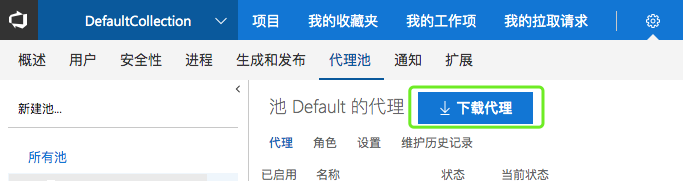
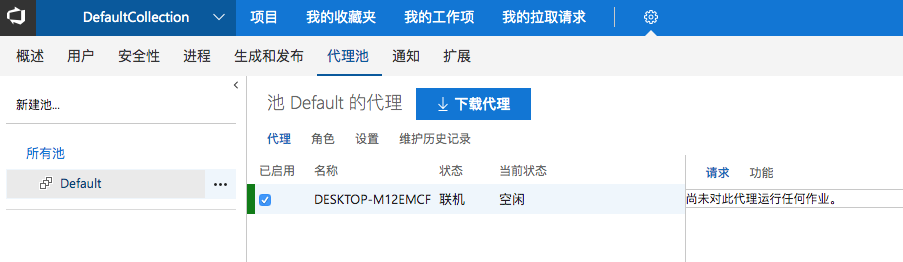

# 配置代理池


## 新增Windows代理

### 下载代理




### 创建代理工作目录

```
mkdir agent ; cd agent  

```

### 配置代理
以管理员身份启动CMD，运行.\config.cmd

```
C:\Users\Lizeyang\Desktop\share>cd C:\Users\Lizeyang\Desktop\share

C:\Users\Lizeyang\Desktop\share>.\config.cmd

>> 连接:

输入 服务器 URL > http://127.0.0.1:8080/tfs
输入 身份验证类型 (对于 Integrated 按 Enter) >
正在连接到服务器...

>> 注册代理:

输入 代理池 (对于 default 按 Enter) >
输入 代理名称 (对于 DESKTOP-M12EMCF 按 Enter) >
正在扫描工具功能。
正在连接到服务器。
已成功添加代理
正在测试代理连接。
输入 工作文件夹 (对于 _work 按 Enter) >
2019-04-04 01:55:29Z: 设置已保存。
输入 是否将代理作为服务运行? (是/否) (对于 N 按 Enter) > y
输入 要用于服务的用户帐户 (对于 NT AUTHORITY\NETWORK SERVICE 按 Enter) >
Granting file permissions to 'NT AUTHORITY\NETWORK SERVICE'.
已成功安装服务 vstsagent.127.DESKTOP-M12EMCF
已成功设置服务 vstsagent.127.DESKTOP-M12EMCF 的恢复选项
已成功配置服务 vstsagent.127.DESKTOP-M12EMCF
已成功启动服务 vstsagent.127.DESKTOP-M12EMCF

```

### 启动代理

```
C:\Users\Lizeyang\Desktop\share>.\run.cmd
正在扫描工具功能。
正在连接到服务器。
2019-04-04 01:55:59Z: 侦听作业
```

效果


### 删除代理

```
C:\Users\Lizeyang\Desktop\share>.\config.cmd remove
正在从服务器删除代理
输入 身份验证类型 (对于 Integrated 按 Enter) > http://127.0.0.1:8080/tfs
为 身份验证类型 输入一个有效值。
输入 身份验证类型 (对于 Integrated 按 Enter) >
正在连接到服务器...
已成功: 正在从服务器删除代理
正在删除 .credentials
已成功: 正在删除 .credentials
正在删除 .agent
已成功: 正在删除 .agent
```