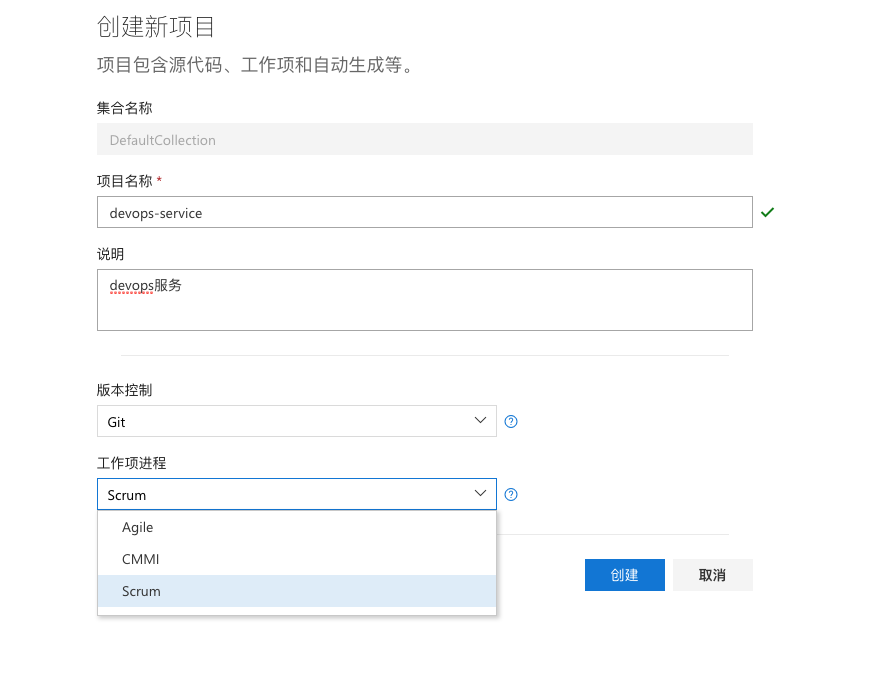
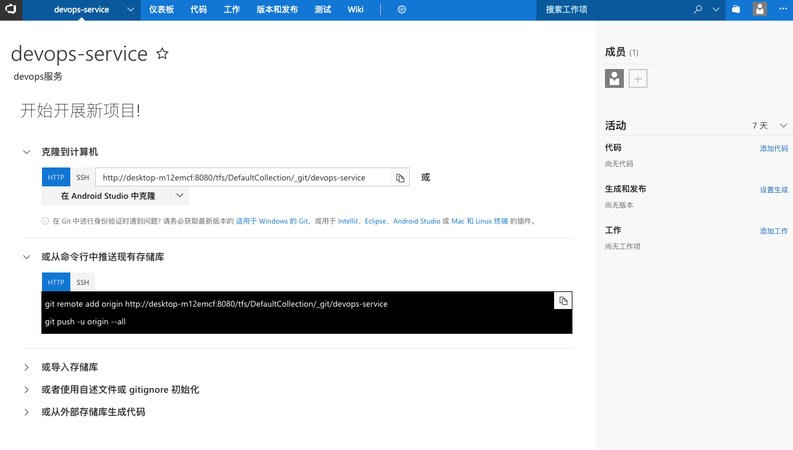
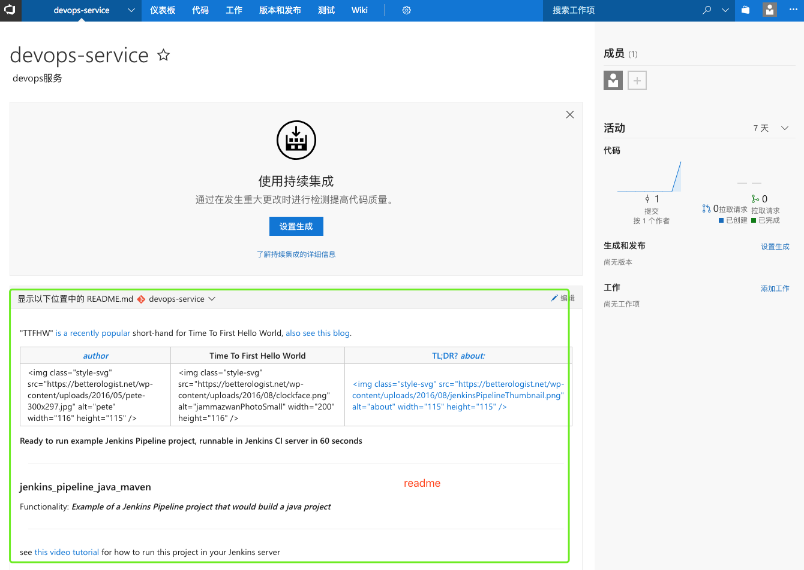
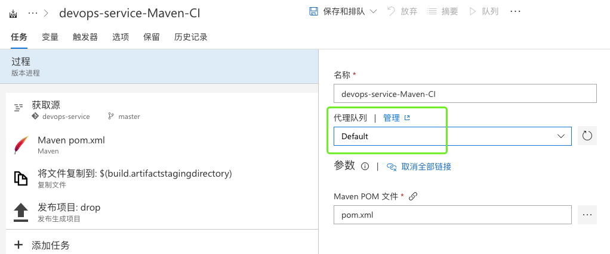
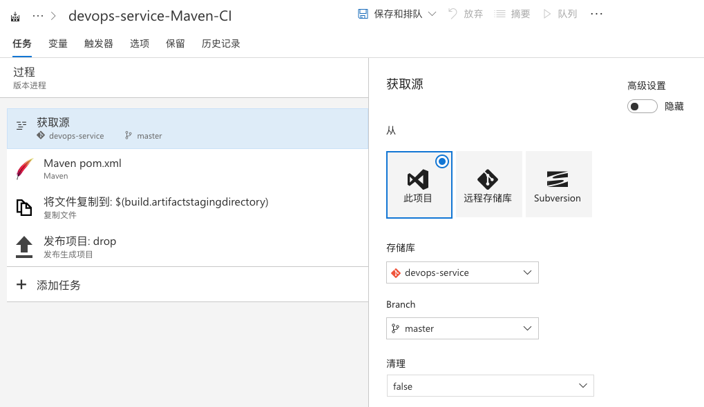
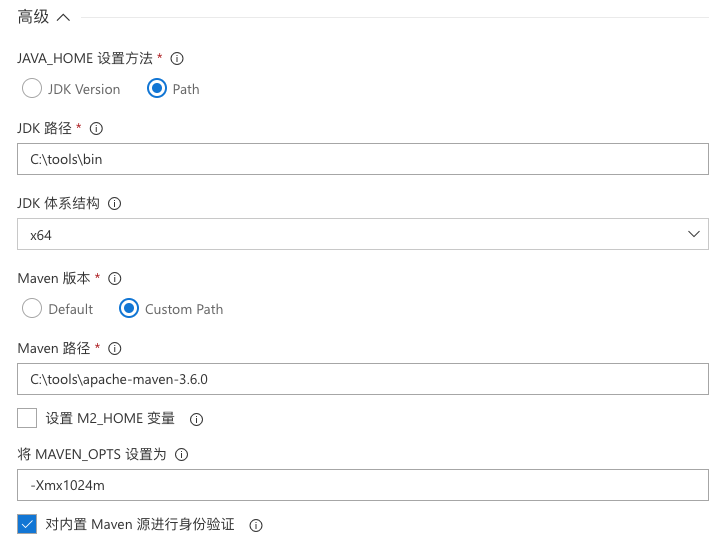
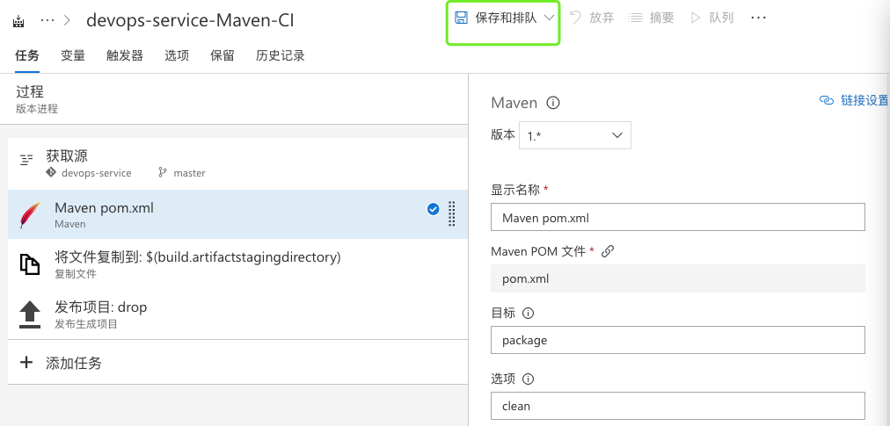

# 发布maven项目


## 新建项目




## 上传测试代码

```
#测试demo
git clone https://github.com/TTFHW/jenkins_pipeline_java_maven.git 
#项目地址
git clone http://desktop-m12emcf:8080/tfs/DefaultCollection/_git/devops-service  

mv jenkins_pipeline_java_maven/* devops-service/
git add *
git commit -m 'test'
git push origin master

Enumerating objects: 15, done.
Counting objects: 100% (15/15), done.
Delta compression using up to 4 threads.
Compressing objects: 100% (10/10), done.
Writing objects: 100% (15/15), 2.17 KiB | 2.17 MiB/s, done.
Total 15 (delta 0), reused 0 (delta 0)
remote: Analyzing objects... (15/15) (81 ms)
remote: Storing packfile... done (58 ms)
remote: Storing index... done (149 ms)
To http://desktop-m12emcf:8080/tfs/DefaultCollection/_git/devops-service
 * [new branch]      master -> master
```



## 使用持续集成


### 选择构建代理


### 设置获取源


### 执行构建




### 保存配置

### 运行


### 结果
