# 第二章 Docker基本操作
## search 搜索镜像
`docker search centos` 搜索centos镜像


## pull 下载镜像
`docker pull <image_name>:<tag> ` latest 最新版 
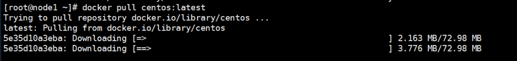

## images 列出镜像
`docker images ` 列出所有的镜像
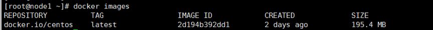


## run 运行容器
`docker run -it --name server1 centos /bin/bash`
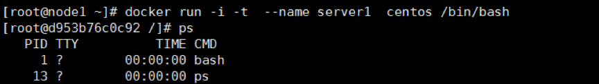


## ps 查看容器列表
`docker ps`
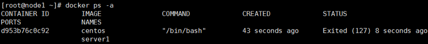

## 控制容器
```
docker start server1
docker stop server1
docker restart server1
```
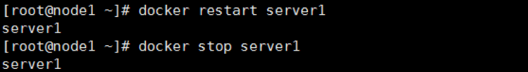


## attach 连接容器
`docker attach <容器名称/id>`
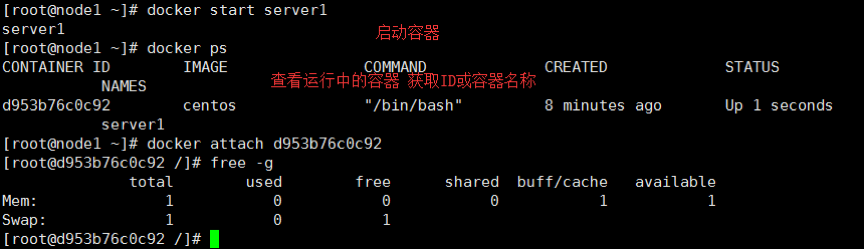

## exec 外部运行容器命令
`docker exec server1 echo "hello"`


## rm 删除容器
- 如果容器已停止 `docker rm container_name`
- 如果容器还在运行 `docker rm -f container_name`

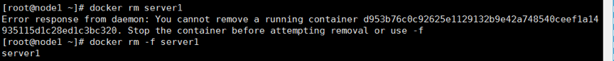


## rmi 删除镜像
`docker rmi imagename`
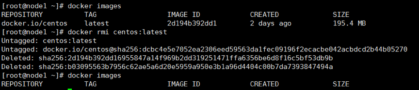


## history 镜像历史
`docker history imagename`
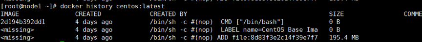

## cp 复制文件
`docker cp <容器名称>:<容器文件路径><本地主机的路径>`
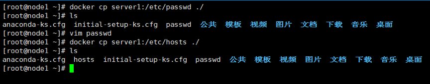

## commit 提交容器修改
`docker commit <选项><容器名称><镜像名称>:<标签>`

复制本地文件到容器中
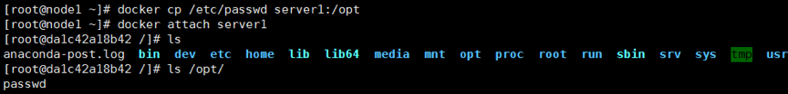

提交修改并查看本地镜像
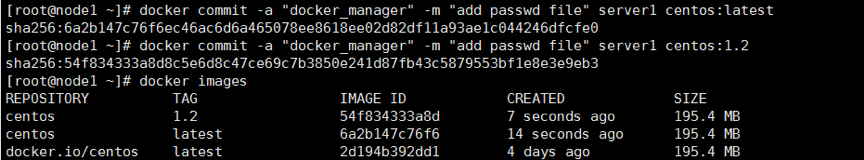

查看镜像历史
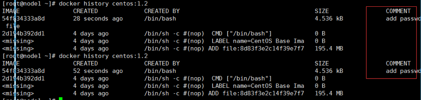


## diff 检查容器文件的变动
`docker diff server1`
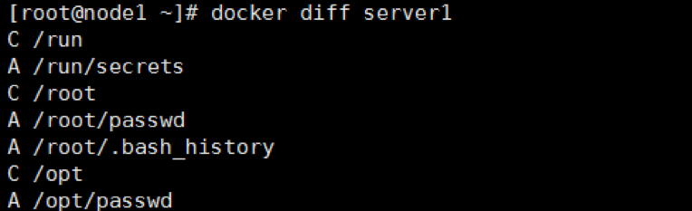

```
A：添加的文件
C：修改文件
D：删除文件
```

## inspect 查看详细信息
`docker inspect imagesname	`
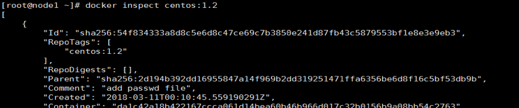


### [下一章](./第一章-Docker简介.md)       <--------->  [首页](./第一章-Docker简介.md) 