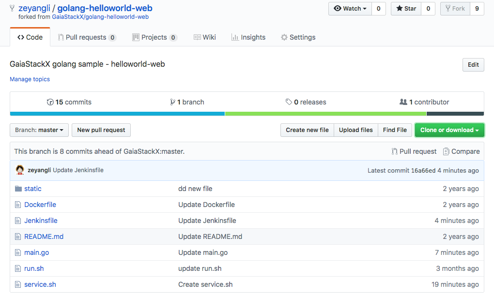
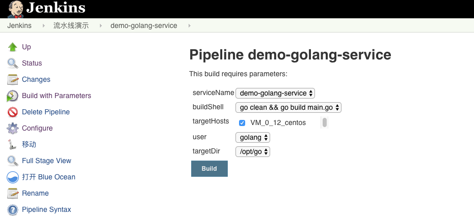
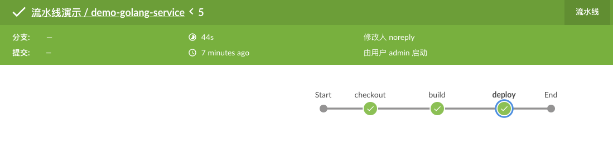

# Golang 项目发布流水线（demo）

demo地址: https://github.com/zeyangli/golang-helloworld-web.git



## 安装开发环境

```
wget  https://dl.google.com/go/go1.10.2.linux-amd64.tar.gz
tar zxf go1.10.2.linux-amd64.tar.gz -C /usr/local/

vim /etc/profile
export GO_PATH=/usr/local/go
export PATH=$PATH:$GO_PATH/bin

source /etc/profile
go version

useradd golang

```


## Jenkins项目
- serviceName:  服务名称
- buildShell: 构建命令
- targetHosts: 发布目标主机
- user:  执行用户
- targetDir:  发布目标主机的工作目录





## Jenkinsfile

将build完成的二进制文件、static、service.sh生产压缩包。
移动到发布目录，发布，解压包，启动服务。

```
String buildShell = "${env.buildShell}"
String targetHosts = "${env.targetHosts}"
String targetDir = "${env.targetDir}"
String serviceName = "${env.serviceName}"
String user = "${env.user}"


node("master"){
    stage("checkout"){
        checkout scm
    }
    
    stage("build"){   
        sh """ 
               export GOPATH=/usr/local/go
               export PATH=$PATH:\$GOPATH/bin
               ${buildShell}
               mkdir -p /srv/salt/${serviceName} 
               tar zcf ${serviceName}.tar.gz main static service.sh 
               rm -fr /srv/salt/${serviceName}/*
               mv ${serviceName}.tar.gz /srv/salt/${serviceName} 
           """
    }
    
    stage("deploy"){
        sh " salt ${targetHosts} cmd.run ' rm -fr  ${targetDir}/* '"
        sh " salt ${targetHosts} cp.get_file salt://${serviceName}/${serviceName}.tar.gz  ${targetDir}/${serviceName}.tar.gz mkdirs=True"
        sh " salt ${targetHosts} cmd.run 'chown ${user}:${user} ${targetDir} -R '"
        sh " salt ${targetHosts} cmd.run 'su - ${user} -c \" cd ${targetDir} && tar zxf ${serviceName}.tar.gz \" '"
        sh " salt ${targetHosts} cmd.run 'su - ${user} -c \"cd ${targetDir} &&  sh service.sh stop\" ' "
        sh " salt ${targetHosts} cmd.run 'su - ${user} -c \"cd ${targetDir} &&  sh service.sh start ${targetDir}\" ' "
    }


}


```


## 服务控制脚本

```
#!/bin/bash

targetDir=$2

start(){
    cd ${targetDir}
    nohup ./main >>/dev/null 2>&1& echo $! > service.pid
    cd -
    
}


stop(){
    pid=`cat service.pid`
    if [ -z $pid ]
    then 
        echo "pid"
    else
        kill -9 ${pid}
        kill -9 ${pid}
        kill -9 ${pid}
    fi
}


case $1 in
start)
    start
    ;;
stop)
    stop
    ;;
    
restart)
    stop
    sleep 5
    start
    ;;
*)
    echo "[start|stop|restart]"
    ;;
    
esac


```

## 构建输出



```
Started by user admin
Obtained Jenkinsfile from git https://github.com/zeyangli/golang-helloworld-web.git
Running in Durability level: MAX_SURVIVABILITY
[Pipeline] Start of Pipeline
[Pipeline] node
Running on Jenkins in /var/lib/jenkins/workspace/demo/demo-golang-service
[Pipeline] {
[Pipeline] stage
[Pipeline] { (checkout)
[Pipeline] checkout
using credential 24982560-17fc-4589-819b-bc5bea89da77
 > /root/bin/git rev-parse --is-inside-work-tree # timeout=10
Fetching changes from the remote Git repository
 > /root/bin/git config remote.origin.url https://github.com/zeyangli/golang-helloworld-web.git # timeout=10
Fetching upstream changes from https://github.com/zeyangli/golang-helloworld-web.git
 > /root/bin/git --version # timeout=10
using GIT_ASKPASS to set credentials gitlab
 > /root/bin/git fetch --tags --progress https://github.com/zeyangli/golang-helloworld-web.git +refs/heads/*:refs/remotes/origin/*
 > /root/bin/git rev-parse refs/remotes/origin/master^{commit} # timeout=10
 > /root/bin/git rev-parse refs/remotes/origin/origin/master^{commit} # timeout=10
Checking out Revision 16a66ed8523442dd04bc6890fd30ff26455fa4c3 (refs/remotes/origin/master)
 > /root/bin/git config core.sparsecheckout # timeout=10
 > /root/bin/git checkout -f 16a66ed8523442dd04bc6890fd30ff26455fa4c3
Commit message: "Update Jenkinsfile"
 > /root/bin/git rev-list --no-walk 09d6c9f794f1337f1ec0928106991efd5354ddf8 # timeout=10
[Pipeline] }
[Pipeline] // stage
[Pipeline] stage
[Pipeline] { (build)
[Pipeline] sh
+ export GOPATH=/usr/local/go
+ GOPATH=/usr/local/go
+ export PATH=/sbin:/usr/sbin:/bin:/usr/bin:/usr/local/go/bin
+ PATH=/sbin:/usr/sbin:/bin:/usr/bin:/usr/local/go/bin
+ go clean
warning: GOPATH set to GOROOT (/usr/local/go) has no effect
+ go build main.go
warning: GOPATH set to GOROOT (/usr/local/go) has no effect
+ mkdir -p /srv/salt/demo-golang-service
+ tar zcf demo-golang-service.tar.gz main static service.sh
+ rm -fr /srv/salt/demo-golang-service/demo-golang-service.tar.gz
+ mv demo-golang-service.tar.gz /srv/salt/demo-golang-service
[Pipeline] }
[Pipeline] // stage
[Pipeline] stage
[Pipeline] { (deploy)
[Pipeline] sh
+ salt VM_0_12_centos cmd.run ' rm -fr  /opt/go/* '
VM_0_12_centos:
[Pipeline] sh
+ salt VM_0_12_centos cp.get_file salt://demo-golang-service/demo-golang-service.tar.gz /opt/go/demo-golang-service.tar.gz mkdirs=True
VM_0_12_centos:
    /opt/go/demo-golang-service.tar.gz
[Pipeline] sh
+ salt VM_0_12_centos cmd.run 'chown golang:golang /opt/go -R '
VM_0_12_centos:
[Pipeline] sh
+ salt VM_0_12_centos cmd.run 'su - golang -c " cd /opt/go && tar zxf demo-golang-service.tar.gz " '
VM_0_12_centos:
[Pipeline] sh
+ salt VM_0_12_centos cmd.run 'su - golang -c "cd /opt/go &&  sh service.sh stop" '
VM_0_12_centos:
    cat: service.pid: No such file or directory
    pid
[Pipeline] sh
+ salt VM_0_12_centos cmd.run 'su - golang -c "cd /opt/go &&  sh service.sh start /opt/go" '
VM_0_12_centos:
    /opt/go
[Pipeline] }
[Pipeline] // stage
[Pipeline] }
[Pipeline] // node
[Pipeline] End of Pipeline
Finished: SUCCESS

```
