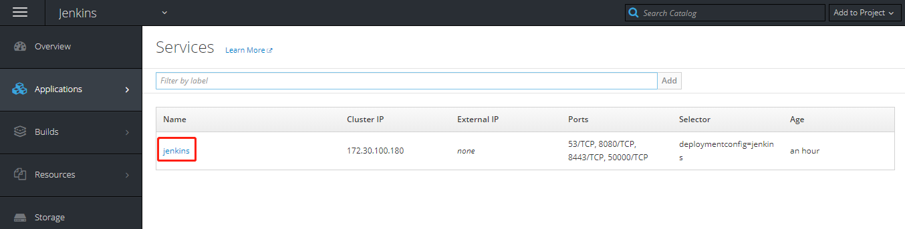
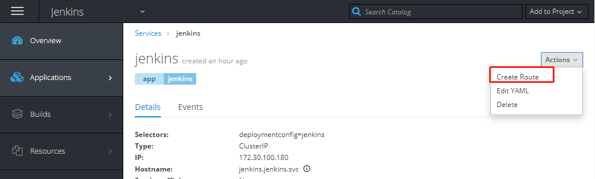
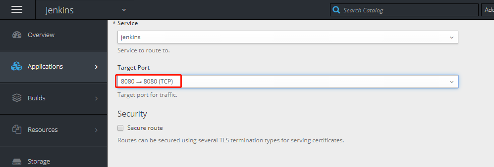
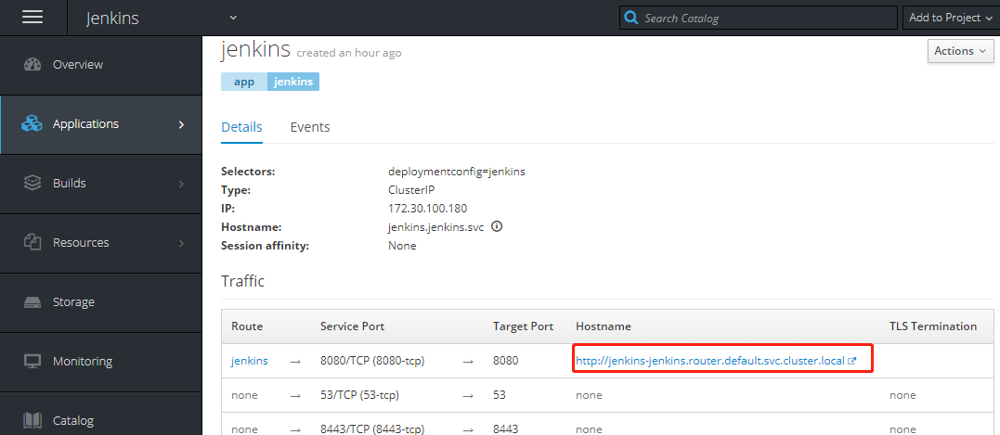
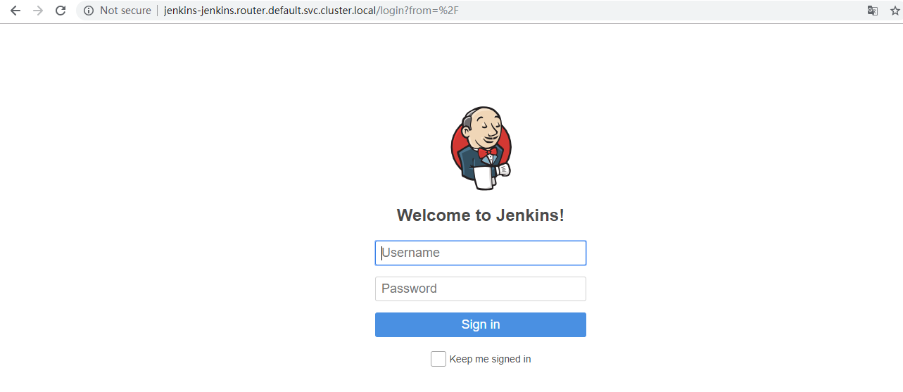

# 基于OpenShift平台部署Jenkins


## DeploymentConfig(jenkin-dc.yml)

```
apiVersion: apps.openshift.io/v1
kind: DeploymentConfig
metadata:
  labels:
    app: jenkins
  name: jenkins
  namespace: jenkins
spec:
  replicas: 2
  selector:
    app: jenkins
    deploymentconfig: jenkins
  strategy:
    activeDeadlineSeconds: 21600
    resources: {}
    rollingParams:
      intervalSeconds: 1
      maxSurge: 25%
      maxUnavailable: 25%
      timeoutSeconds: 600
      updatePeriodSeconds: 1
    type: Rolling
  template:
    metadata:
      annotations:
        openshift.io/generated-by: OpenShiftWebConsole
      creationTimestamp: null
      labels:
        app: jenkins
        deploymentconfig: jenkins
    spec:
      containers:
        - env:
            - name: JENKINS_PASSWORD
              value: xxxxxxx
          image: 'openshift/jenkins-2-centos7:v3.11'
          imagePullPolicy: IfNotPresent
          name: jenkins
          ports:
            - containerPort: 53
              protocol: TCP
            - containerPort: 8080
              protocol: TCP
            - containerPort: 8443
              protocol: TCP
            - containerPort: 50000
              protocol: TCP
          resources: {}
          terminationMessagePath: /dev/termination-log
          terminationMessagePolicy: File
          volumeMounts:
            - mountPath: /var/lib/jenkins
              name: jenkins-1
      dnsPolicy: ClusterFirst
      restartPolicy: Always
      schedulerName: default-scheduler
      securityContext: {}
      terminationGracePeriodSeconds: 30
      volumes:
        - emptyDir: {}
          name: jenkins-1
  test: false
  triggers:
    - type: ConfigChange
```

## RBAC(jenkins-rbac.yml)

```
kind: Role
apiVersion: rbac.authorization.k8s.io/v1
metadata:
  namespace: jenkins
  name: jenkinsrole
rules:
- apiGroups: [""]
  resources: ["pods","deployments","namespaces"]
  verbs: ["get","list","watch","create"]

---
kind: RoleBinding
apiVersion: rbac.authorization.k8s.io/v1
metadata:
  name: jenkinsrolebind
  namespace: jenkins
subjects:
- kind: ServiceAccount
  name: default
  namespace: jenkins
roleRef:
  kind: Role
  name: jenkinsrole

```

## Install 

```
docker pull openshift/jenkins-2-centos7:v3.11
oc create -f jenkins-rbac.yml
oc create -f jenkins-dc.yml

```

## 创建service和route
### 1.通过图形界面创建
  
  
  
  
  
### 2.通过yaml创建

jenkins-service.yml
```
apiVersion: v1
kind: Service
metadata:
  labels:
    app: jenkins
  name: jenkins
  namespace: jenkins
spec:
  clusterIP: 172.30.100.180
  ports:
  - name: 53-tcp
    port: 53
    protocol: TCP
    targetPort: 53
  - name: 8080-tcp
    port: 8080
    protocol: TCP
    targetPort: 8080
  - name: 8443-tcp
    port: 8443
    protocol: TCP
    targetPort: 8443
  - name: 50000-tcp
    port: 50000
    protocol: TCP
    targetPort: 50000
  selector:
    deploymentconfig: jenkins
  sessionAffinity: None
  type: ClusterIP
```

jenkins-router.yml

```
apiVersion: route.openshift.io/v1
kind: Route
metadata:
  labels:
    app: jenkins
  name: jenkins
  namespace: jenkins
spec:
  host: jenkins-jenkins.router.default.svc.cluster.local
  port:
    targetPort: 8080-tcp
  to:
    kind: Service
    name: jenkins
    weight: 100
  wildcardPolicy: None
```

## 更改本地hosts

```
192.168.0.21 node01.example.com
192.168.0.32 node02.example.com
192.168.0.21 jenkins-jenkins.router.default.svc.cluster.local
```

## 验证测试
账号密码： 默认admin 和JENKINS_PASSWORD变量的密码 xxxxxxxx


