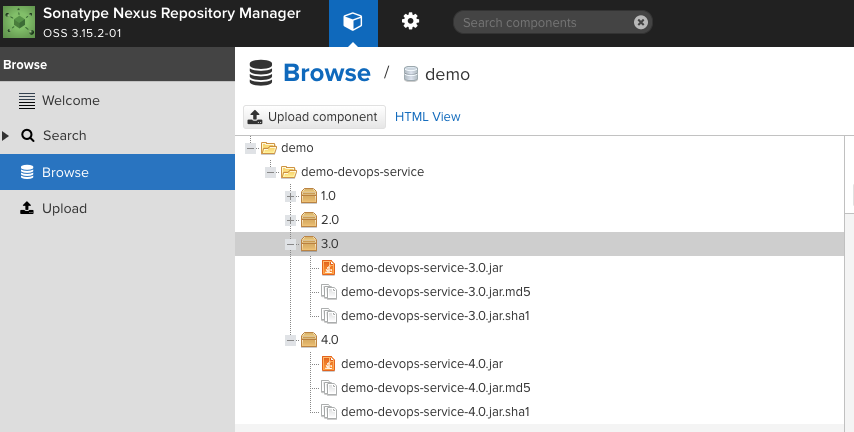
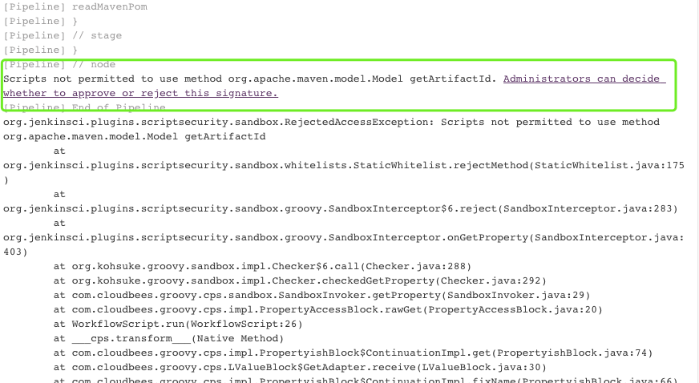
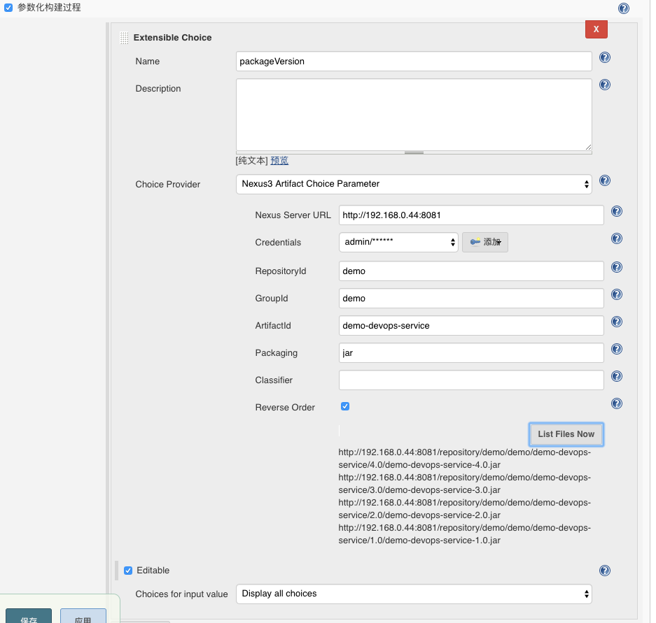
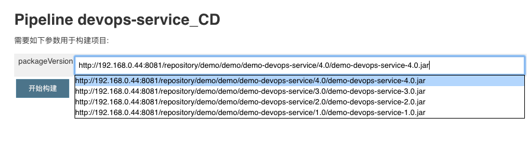
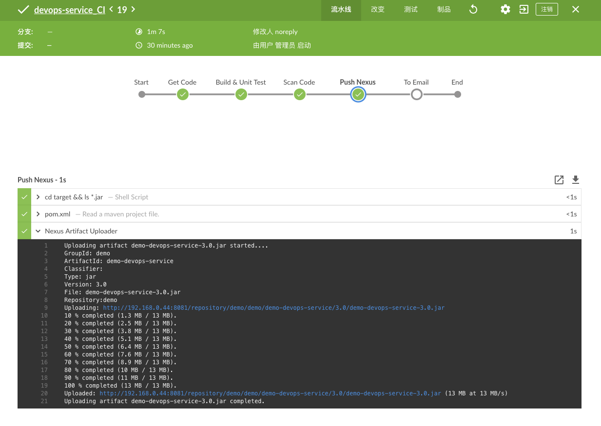

# Jenkins集成Nexus

demo地址: https://github.com/zeyangli/springboot-helloworld.git


## 总体目标
开发人员提交代码，更新pom信息。jenkins读取pom文件中的信息，通过nexus插件上传到nexus。通过nexus参数获取最新的包下载地址。


## 项目配置

### pom.xml文件
- groupId: 业务名称简称
- artifactId: 应用名称
- version: 版本信息

```
<groupId>demo</groupId>
<artifactId>demo-devops-service</artifactId>
<version>4.0</version>

```
注: 没做一次更新都要更改version信息，因为release的maven仓库设置了不能同版本更新。


## Nexus（create repo）
 


## Jenkins（CI）
- 安装插件：Pipeline Utility Steps 
- 安装插件：Nexus Artifact Uploader
- 设置scriptApproval: 允许Approval

 


```
node("master"){
    
    stage("Get Code"){
        checkout scm
    }
    
    stage("Build & Unit Test"){
        def mvnHome="/usr/local/apache-maven-3.6.0" 
        sh "${mvnHome}/bin/mvn clean install "
        
    }
    
    stage("Scan Code"){
        println("code scan")
        
    }
    
    stage("Push Nexus"){
        def pom = readMavenPom file: 'pom.xml'
        nexusArtifactUploader(artifacts: [[artifactId: "${pom.artifactId}", 
                                           classifier: '', 
                                           file: "./target/${pom.artifactId}-${pom.version}.${pom.packaging}", 
                                           type: "${pom.packaging}"]],
                              credentialsId: 'nexus-admin', 
                              groupId: "${pom.groupId}", 
                              nexusUrl: '192.168.0.44:8081', 
                              nexusVersion: 'nexus3', 
                              protocol: 'http', 
                              repository: "${pom.groupId}", 
                              version: "${pom.version}")
        
    }
    
    stage("To Email "){
        
        
    }
}

```

## Jenkins (CD)
- 安装插件: Maven Artifact ChoiceListProvider (Nexus)







## 构建
