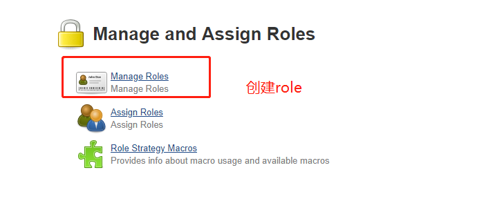
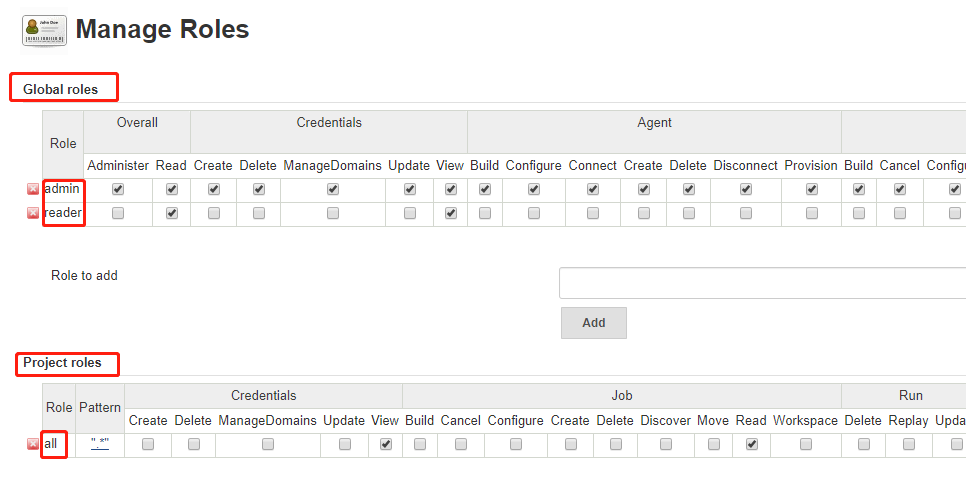
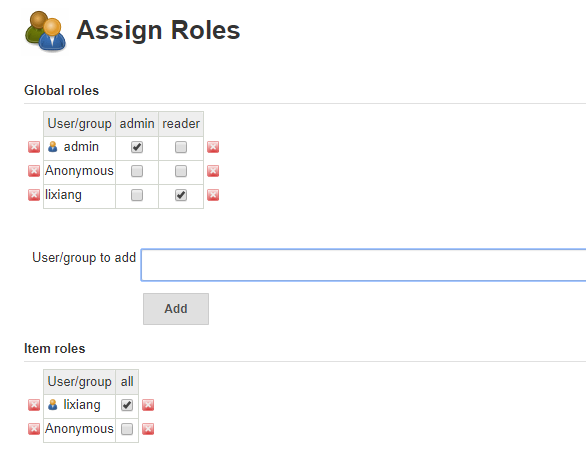

# Jenkins 用户授权脚本






## API 接口

### 创建用户

```
method:POST
url: http://demo.com:8080/securityRealm/createAccountByAdmin
data: {"username": userName, "password1": '123456', "password2": '123456', "fullname" : userName,"email" : userName + '@jenkins.com'}

```
### 用户授权插件

```
method:POST
url:http://demo.com:8080/role-strategy/strategy/assignRole
roletype: globalRoles projectRoles
data : {'type': 'globalRoles','roleName': roleName,'sid': userName}
```

## 脚本内容(Python)

```
#coding:utf8

#用户授权脚本

import requests
import sys

class auth(object):

    def __init__(self):
        self.Jenkins = {"url":"http://deme.com:8080/role-strategy/strategy/assignRole",
                         "passwd":"xxxxxxxxxxxx"}

    #创建用户
    def Create(self,userName):
        uurl="http://demo.com:8080/securityRealm/createAccountByAdmin"
        refdata = {"username": userName,
                   "password1": '123456',
                   "password2": '123456',
                   "fullname" : userName,
                   "email" : userName + '@jenkins.com'}

        response = requests.post(uurl,data=refdata,auth=('admin',self.Jenkins["passwd"]))
        #print(response.status_code,response.text)

    #授权
    def Grant(self,roleType,roleName,userName):
        self.Create(userName)
        if roleType == "global" :
            data = {'type': 'globalRoles','roleName': roleName,'sid': userName}
        elif roleType == "project" :
            data = {'type': 'projectRoles','roleName': roleName,'sid': userName}       
        
        response = requests.post(self.Jenkins["url"], 
                                data=data, 
                                auth=('admin', self.Jenkins["passwd"]))
        print(response.status_code,response.text)
        
        return int(response.status_code)
        

if __name__ == '__main__':
    if  sys.argv[1] == "help":
        print("1. 添加用户到users.txt中，每行一个.")
        print("2. python role.py  global globalName")
        print("3. python role.py  project projectName")
    else:
        server = auth()
        roleType = sys.argv[1]
        roleName = sys.argv[2]

        #get users
        f = open("users.txt","r")
        users = f.readlines()
        f.close()

        #do grant
        for user in users :
            result = server.Grant(roleType,roleName,user)
            if result <=400 :
                print("--->{0}-->{1}-->{2} --->Success!".format(user,roleType,roleName))
            else:
                raise Exception("--->{0}-->{1}-->{2} --->Error!".format(user,roleType,roleName))
```

users.txt

```
zhangsan
lisi
wangwu
```


