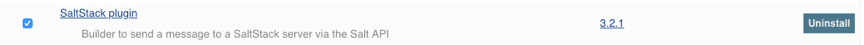
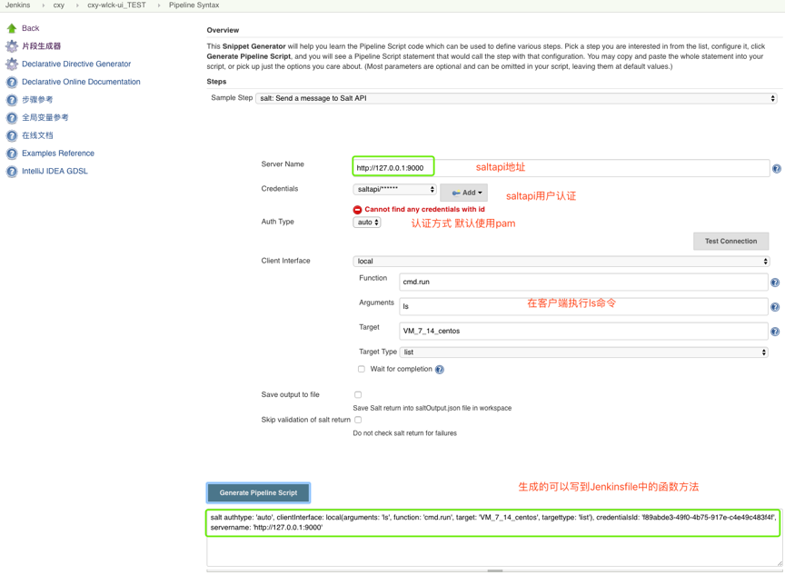
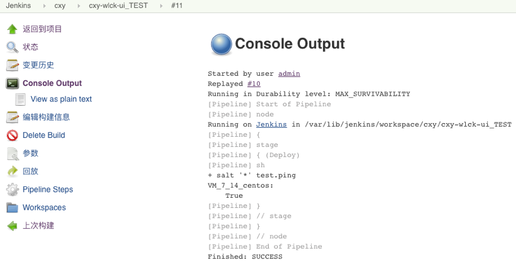

# 第四章 Jenkins集成SaltStack
## 1. 安装saltstack
- saltstack原理详细可以参考saltstack官方文档

### 1.1 安装salt-master（jenkins）

```
yum -y install salt-master
service salt-master start
chkconfig salt-master on

```

### 1.2 安装salt-minion(应用发布机器)

```
yum -y install salt-minion
service salt-minion start
chkconfig salt-minion on

#编辑/etc/salt/minion 文件填写对应的master地址
master: 192.168.0.41

#在master节点上认证客户端
salt-key -L 
salt-key -a clientName

```

### 1.3 安装salt-api（Jenkins）

```
yum -y install salt-api
service salt-api start
chkconfig salt-api on

#添加用于操作api的系统用户
useradd saltapi
passwd saltapi 

#编辑/etc/salt/master 
file_roots:    #允许使用salt发布文件
  base:
    - /srv/salt
rest_cherrypy:  #以下是saltapi配置
  port: 9000
  disable_ssl: True
  debug: True
external_auth:  
  pam:  
    saltapi:  
      - .*  
      - '@wheel'  
      - '@runner'

service salt-master restart 
service salt-api start 

```

### 1.4 测试

```
curl http://127.0.0.1:9000/login -d username='saltapi' -d password='123456' -d eauth='pam'

```

- 返回token则成功


## 2. 集成Jenkins

### 2.1 测试salt（saltapi方式）

- 安装saltstack插件


- 生成Jenkinfile方法（项目->Pipeline Syntax->片段生成器）


- Jenkinsfile实例

```
#!groovy

//构建参数
String targetHosts = "${env.targetHosts}"

//saltapi模板
def Salt(salthost,saltfunc,saltargs) {
    result = salt(authtype: 'pam', 
                clientInterface: local( arguments: saltargs,
                                        function: saltfunc, 
                                        target: salthost, 
                                        targettype: 'list'),
                credentialsId: "f89abde3-49f0-4b75-917e-c4e49c483f4f", 
                servername: "http://0.0.0.0:9000")
   
    println(result)
    PrintMes(result,'blue')
    return  result
}

node("master"){
    stage("Deploy"){
        Salt("${targetHosts}","cmd.run","ls")
    }

}


```


### 2.2 测试salt（cmd方式）
- Jenkinsfile

```
node {
   stage("Deploy"){
       sh "salt * test.ping"
   }
}


```

- 构建测试



### [下一章](./第九章-流水线实践(一).md)    <--------->  [上一章](./第七章-集成Jenkins(三).md)