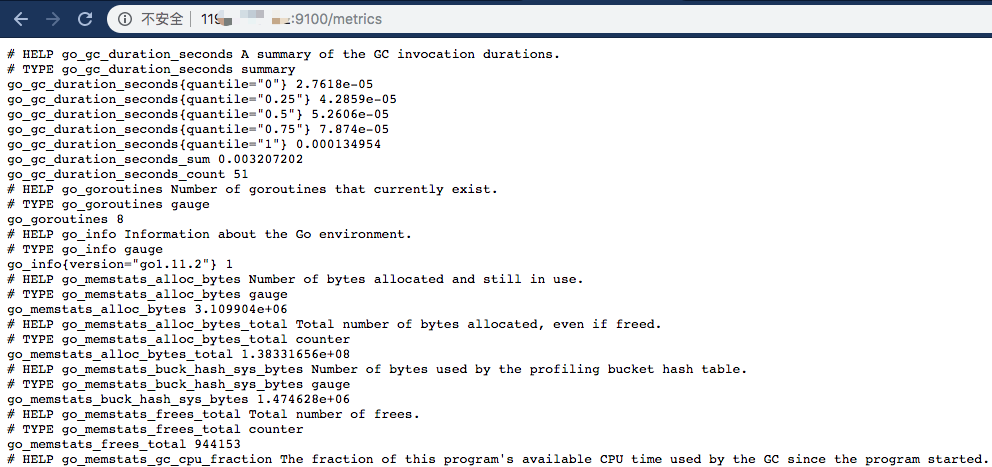
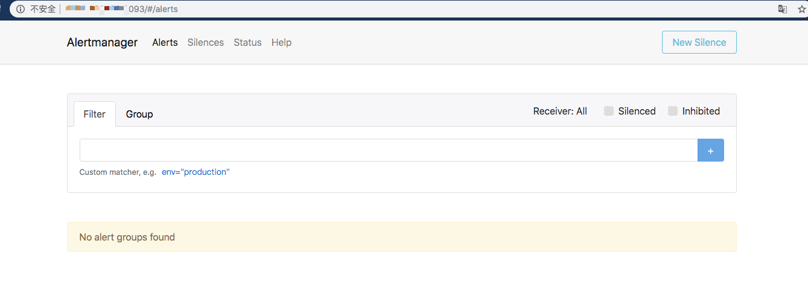
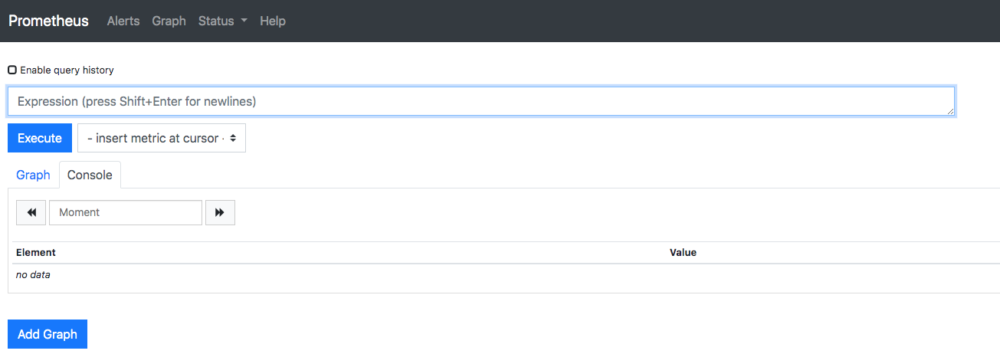
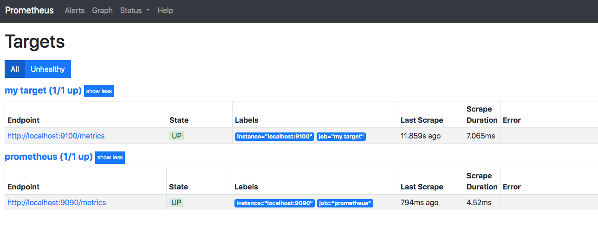
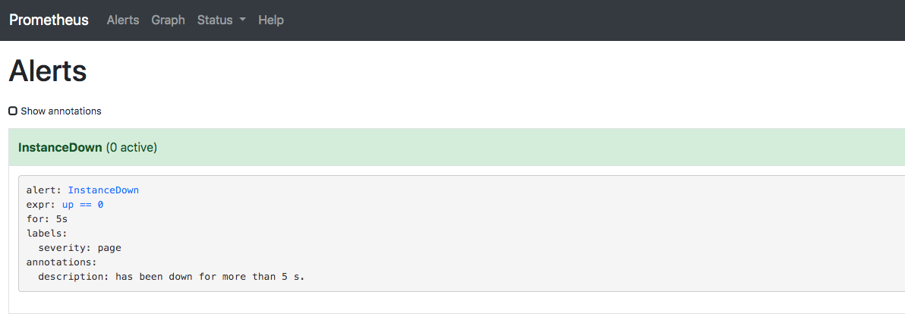
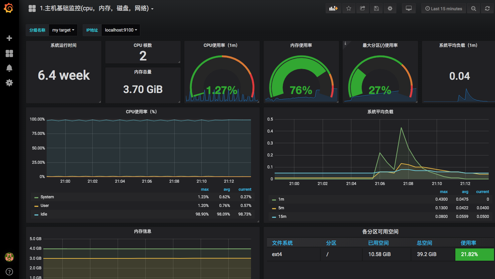
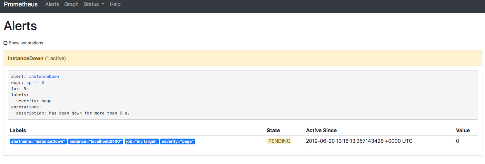
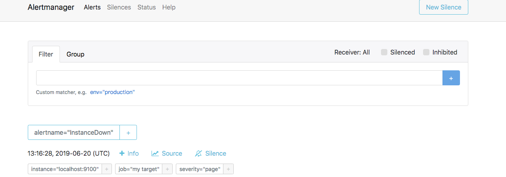
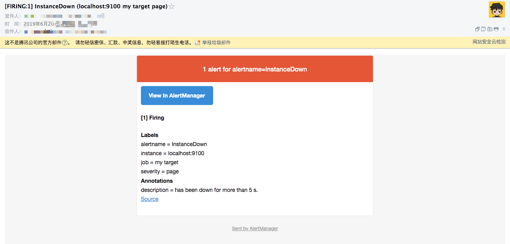

# Prometheus安装部署+监控+绘图+告警


## 安装部分
在官网下载对应的压缩包文件，解压、添加系统服务器、启动。

### Node_exporter
安装命令

```
tar zxf node_exporter-0.17.0.linux-amd64.tar.gz -C /usr/local
vim /etc/systemd/system/node_exporter.service 

[Unit]
Description=node_exporter
After=network.target

[Service]
Restart=on-failure
ExecStart=/usr/local/node_exporter-0.17.0.linux-amd64/node_exporter

[Install]
WantedBy=multi-user.target


systemctl start node_exporter
systemctl status node_exporter
systemctl enable node_exporter
```

验证


### AlertManager

安装命令

```
tar zxf alertmanager-0.17.0.linux-amd64.tar.gz  -C /usr/local
vim /etc/systemd/system/alertmanager.service

[Unit]
Description=Alertmanager
After=network-online.target

[Service]
Restart=on-failure
ExecStart=/usr/local/alertmanager-0.17.0.linux-amd64/alertmanager --config.file=/usr/local/alertmanager-0.17.0.linux-amd64/alertmanager.yml

[Install]
WantedBy=multi-user.target

systemctl start alertmanager
systemctl status alertmanager
systemctl enable alertmanager

netstat -anlpt | grep 9093

```

验证



### Prometheus

Shell命令

```
tar zxf prometheus-2.9.2.linux-amd64.tar.gz -C /usr/local
vim /etc/systemd/system/prometheus.service
 
[Unit]
Description=Prometheus Server
Documentation=https://prometheus.io/docs/introduction/overview/
After=network-online.target

[Service]
Restart=on-failure
ExecStart=/usr/local/prometheus-2.9.2.linux-amd64/prometheus --config.file=/usr/local/prometheus-2.9.2.linux-amd64/prometheus.yml --storage.tsdb.path=/var/lib/prometheus --web.external-url=http://0.0.0.0:9090

[Install]
WantedBy=multi-user.target

```


验证



### Grafana

安装

```
下载：https://mirrors.tuna.tsinghua.edu.cn/grafana/yum/el7/grafana-5.4.2-1.x86_64.rpm


rpm -ivh grafana-5.4.2-1.x86_64.rpm

systemctl start grafana-server
systemctl status grafana-server
systemctl enable grafana-server


netstat -anlpt | grep 3000
```


验证


## 配置部分

### AlertManager

配置文件

```
global:
  resolve_timeout: 5m
  smtp_smarthost: 'smtp.qq.com:465'
  smtp_from: 'xxxxx@qq.com'
  smtp_auth_username: 'xxxx@qq.com'
  smtp_auth_password: 'xxxkbpfmygbecg'
  smtp_require_tls: false

route:
  group_by: ['alertname']
  group_wait: 10s
  group_interval: 10s
  repeat_interval: 1h
  receiver: 'toemail'
receivers:
- name: 'toemail'
  email_configs:
  - to: 'xxxxx@qq.com'
    send_resolved: true
- name: 'web.hook'
  webhook_configs:
  - url: 'http://127.0.0.1:5001/'
inhibit_rules:
  - source_match:
      severity: 'critical'
    target_match:
      severity: 'warning'
    equal: ['alertname', 'dev', 'instance']

```

### Prometheus

```
# my global config
global:
  scrape_interval:     15s # Set the scrape interval to every 15 seconds. Default is every 1 minute.
  evaluation_interval: 15s # Evaluate rules every 15 seconds. The default is every 1 minute.
  # scrape_timeout is set to the global default (10s).

# Alertmanager configuration
alerting:
  alertmanagers:
  - static_configs:
    - targets:
       - localhost:9093

# Load rules once and periodically evaluate them according to the global 'evaluation_interval'.
rule_files:
  - "rules/host_rules.yml"
  # - "second_rules.yml"

# A scrape configuration containing exactly one endpoint to scrape:
# Here it's Prometheus itself.
scrape_configs:
  # The job name is added as a label `job=<job_name>` to any timeseries scraped from this config.
  - job_name: 'prometheus'

    # metrics_path defaults to '/metrics'
    # scheme defaults to 'http'.

    static_configs:
    - targets: ['localhost:9090']


  - job_name: 'my target'
    static_configs:
    - targets: ['localhost:9100']

```

 mkdir rules && vim rules/host_rules.yml
 
 ```
groups:
- name: 'Linux Instances'
  rules:
  - alert: InstanceDown
    expr: up == 0
    for: 5s
    labels:
      severity: page
    # Prometheus templates apply here in the annotation and label fields of the alert.
    annotations:
      description: 'has been down for more than 5 s.'

```

### 验证

查看目标


查看告警配置


查看监控数据（https://grafana.com/dashboards/9276）



## 告警
### 模拟node_exporter宕机
`systemctl stop node_exporter`




### 查看邮箱收件箱



以上就完成了一个简单的监控告警配置！特别感谢网上的一些文档。
参考文档：https://jianshu.com/p/e59cfd15612e
