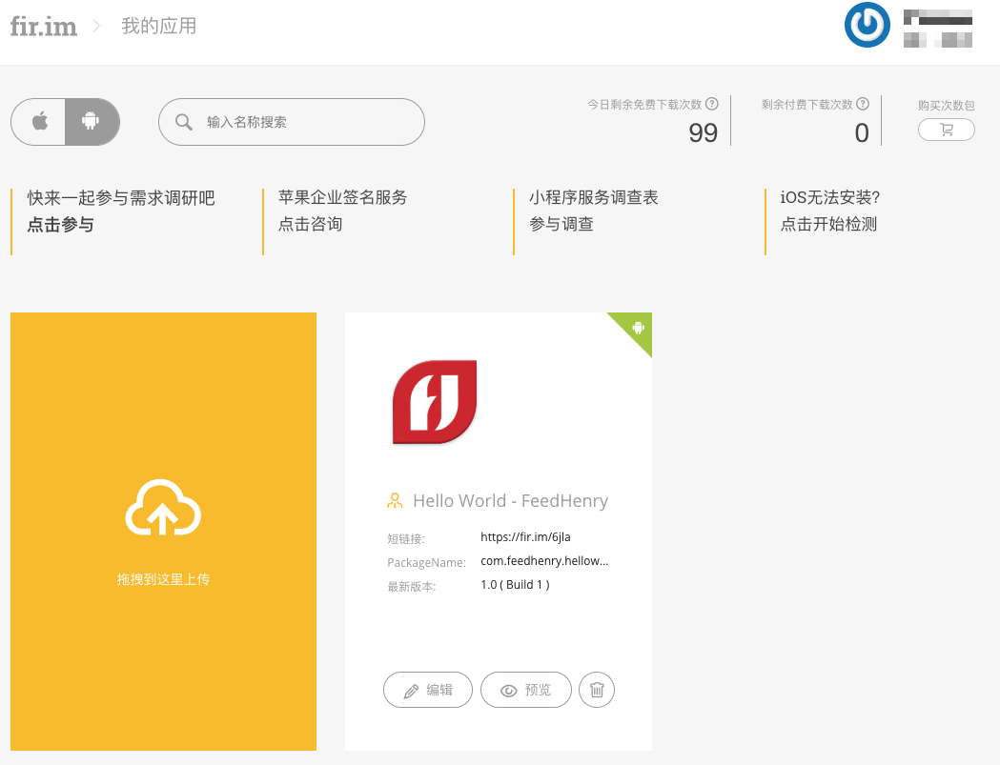

# Android项目发布（手动）


## 1.检出代码

项目地址: https://github.com/zeyangli/helloworld-android-gradle.git

```
git clone https://github.com/zeyangli/helloworld-android-gradle.git

```

## 2.构建打包

目录: helloworld-android-gradle


```
cd helloworld-android-gradle
./gradlew build

Download https://jcenter.bintray.com/com/loopj/android/android-async-http/1.4.9/android-async-http-1.4.9.jar
Download https://jcenter.bintray.com/cz/msebera/android/httpclient/4.3.6/httpclient-4.3.6.jar
Download https://jcenter.bintray.com/com/google/code/gson/gson/2.8.1/gson-2.8.1.jar
Download https://dl.google.com/dl/android/maven2/android/arch/lifecycle/common/1.0.0/common-1.0.0.jar
Download https://dl.google.com/dl/android/maven2/android/arch/core/common/1.0.0/common-1.0.0.jar
Unknown file extension: app/src/main/res/mipmap-xhdpi/ic_launcher.png
Unknown file extension: app/src/main/res/mipmap-mdpi/ic_launcher.png
Unknown file extension: app/src/main/res/mipmap-xxhdpi/ic_launcher.png
Unknown file extension: app/src/main/res/mipmap-hdpi/ic_launcher.png
Unknown file extension: app/src/main/res/mipmap-xxxhdpi/ic_launcher.png

> Task :app:lint
Ran lint on variant release: 4 issues found
Ran lint on variant debug: 4 issues found
Wrote HTML report to file:///root/helloworld-android-gradle/app/build/reports/lint-results.html
Wrote XML report to file:///root/helloworld-android-gradle/app/build/reports/lint-results.xml


BUILD SUCCESSFUL in 1m 49s
58 actionable tasks: 50 executed, 8 up-to-date
```


## 3.上传包到fir
- debug APK: helloworld-android-gradle/app/build/outputs/apk/debug
- release APK: helloworld-android-gradle/app/build/outputs/apk/release




## 4.下载测试
