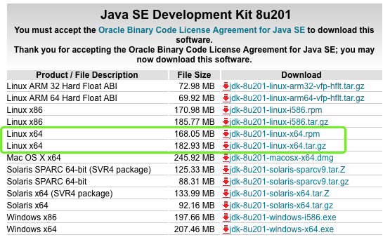

# 搭建Android打包环境（Centos）


## 1.安装JDK


下载地址: http://www.oracle.com/technetwork/java/javase/downloads/jdk8-downloads-2133151.html


```
tar zxf jdk-8u201-linux-x64.tar.gz -C /usr/local

#添加到/etc/profile
export JAVA_HOME=/usr/local/jdk1.8.0_201
export PATH=$PATH:$JAVA_HOME/bin

source /etc/profile

java -version

```

## 2.安装Android SDK Tools

需要翻墙: https://developer.android.com/studio/index.html


```
#解压后会有一个tools目录
unzip  sdk-tools-linux-4333796.zip -d /usr/local

export ANDROID_HOME=/usr/local/
export PATH=$PATH:$ANDROID_HOME/tools/bin

source /etc/profile

sdkmanager --list  #验证环境变量配置准确

[root@VM_7_14_centos ~]# sdkmanager --list | head -10
[======================Warning: File /root/.android/repositories.cfg could not be loaded.
Installed packages:=====================] 100% Computing updates...             
  Path                 | Version | Description                    | Location             
  -------              | ------- | -------                        | -------              
  build-tools;20.0.0   | 20.0.0  | Android SDK Build-Tools 20     | build-tools/20.0.0/  
  build-tools;23.0.1   | 23.0.1  | Android SDK Build-Tools 23.0.1 | build-tools/23.0.1/  
  build-tools;26.0.2   | 26.0.2  | Android SDK Build-Tools 26.0.2 | build-tools/26.0.2/  
  build-tools;28.0.3   | 28.0.3  | Android SDK Build-Tools 28.0.3 | build-tools/28.0.3/  
  platform-tools       | 28.0.2  | Android SDK Platform-Tools     | platform-tools/      
  platforms;android-19 | 4       | Android SDK Platform 19        | platforms/android-19/
  platforms;android-22 | 2       | Android SDK Platform 22        | platforms/android-22/
```


## 3.安装Gradle
下载地址：https://gradle.org/gradle-download/


```
unzip -d /usr/local gradle-5.3-bin.zip
export GRADLE_HOME=/usr/local/gradle-5.3
export PATH=$PATH:$GRADLE_HOME/bin

source /etc/profile

[root@VM_7_14_centos ~]# gradle -v

------------------------------------------------------------
Gradle 5.3
------------------------------------------------------------

Build time:   2019-03-20 11:03:29 UTC
Revision:     f5c64796748a98efdbf6f99f44b6afe08492c2a0

Kotlin:       1.3.21
Groovy:       2.5.4
Ant:          Apache Ant(TM) version 1.9.13 compiled on July 10 2018
JVM:          1.8.0_201 (Oracle Corporation 25.201-b09)
OS:           Linux 2.6.32-696.el6.x86_64 amd64

```

## 4.SDKmanager


```
sdkmanager --list #获取已安装的和可用的包
sdkmanager "platforms;android-28"  #安装和这个包
sdkmanager --uninstall  "platforms;android-28"  #卸载这个包
```

## FAQ

- GLIBC_2.14' not found 
需要升级glibc 参考链接 ： https://blog.csdn.net/dream_gf/article/details/81181388

