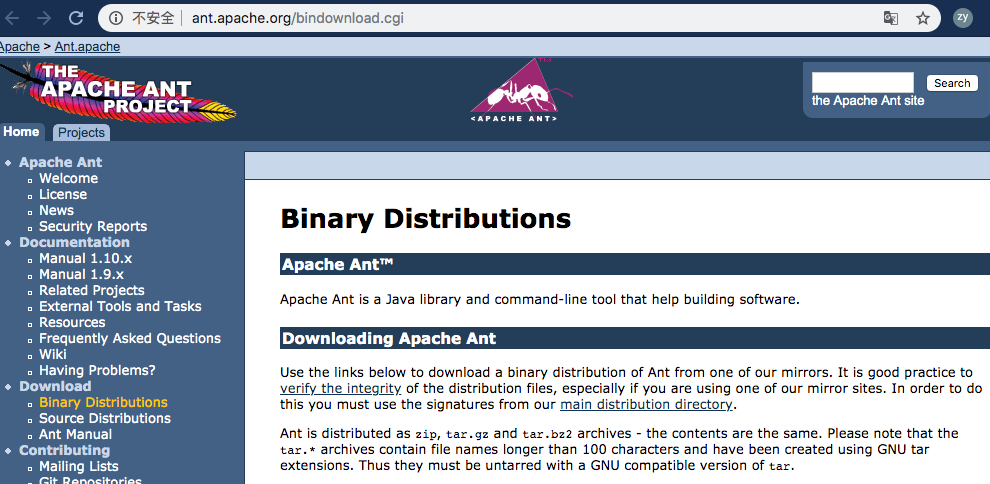
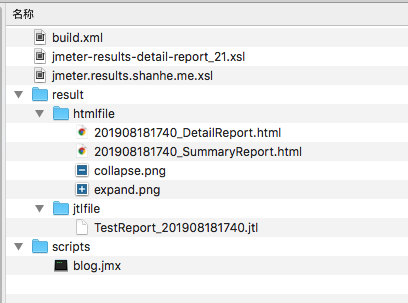
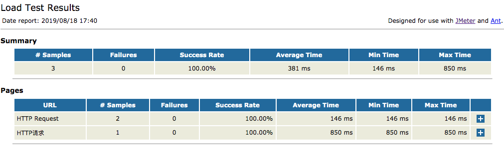

# Ant + Jmeter接口测试

## 安装Ant
下载地址：http://ant.apache.org/bindownload.cgi




```
unzip apache-ant-1.9.14-bin.zip

export ANT_HOME=/usr/local/apache-ant-1.9.14
export PATH=$PATH:$JMETER_HOME/bin:$ANT_HOME/bin

sudo cp ant-jmeter-1.1.1.jar  /usr/local/apache-ant-1.9.14/lib/
sudo cp jmeter.results.shanhe.me.xsl  /usr/local/apache-jmeter-5.1.1/extras/
sudo cp jmeter-results-detail-report_21.xsl  /usr/local/apache-jmeter-5.1.1/extras/
```

## build.xml
将jmx脚本存放到项目scripts目录中

```
<?xml version="1.0" encoding="utf8"?>
<!-- 拷贝报告所需的图片资源至目标目录 -->
<project name="ant-jmeter-test" default="run" basedir=".">
    <tstamp>
        <format property="time" pattern="yyyyMMddHHmm" />
    </tstamp>
    <!-- 需要改成自己本地的jmeter目录-->  
    <property name="jmeter.home" value="/usr/local/apache-jmeter-5.1.1" />
    <!-- jmeter生成的jtl格式的结果报告的路径--> 
    <property name="jmeter.result.jtl.dir" value="./result/jtlfile" />
    <!-- jmeter生成的html格式的结果报告的路径-->
    <property name="jmeter.result.html.dir" value="./result/htmlfile" />
    <!-- ʺ生成的报告的前缀-->  
    <property name="ReportName" value="TestReport_" />
    <property name="jmeter.result.jtlName" value="${jmeter.result.jtl.dir}/${ReportName}${time}.jtl" />
    <property name="jmeter.result.htmlName" value="${jmeter.result.html.dir}/${time}_SummaryReport.html" />
    <property name="jmeter.detail.result.jtlName" value="${jmeter.result.jtl.dir}/${ReportName}${time}.jtl" />
    <property name="jmeter.detail.result.htmlName" value="${jmeter.result.html.dir}/${time}_DetailReport.html" />
    <target name="run">
        <antcall target="test" />
        <antcall target="report" />
	</target>

    <target name="test">
        <taskdef name="jmeter" classname="org.programmerplanet.ant.taskdefs.jmeter.JMeterTask" />
        <jmeter jmeterhome="${jmeter.home}" resultlog="${jmeter.result.jtlName}">
             <!-- 声明要运行的脚本“*.jmx”指包含此目录下的所有jmeter脚本-->
            <testplans dir="./scripts" includes="*.jmx" />
           <property name="jmeter.save.saveservice.output_format" value="xml"/>

        </jmeter>
    </target>
    <path id="xslt.classpath">
            <fileset dir="${jmeter.home}/lib" includes="xalan*.jar"/>
            <fileset dir="${jmeter.home}/lib" includes="serializer*.jar"/>
    </path>

    <target name="report">
        <tstamp> 
                <format property="report.datestamp" pattern="yyyy/MM/dd HH:mm" />
        </tstamp>
        <xslt 
            classpathref="xslt.classpath"
            force="true"
            in="${jmeter.detail.result.jtlName}"
            out="${jmeter.detail.result.htmlName}"
            style="${jmeter.home}/extras/jmeter.results.shanhe.me.xsl">
            <param name="dateReport" expression="${report.datestamp}"/>
        </xslt>
        <xslt 
            classpathref="xslt.classpath"
            force="true"
            in="${jmeter.result.jtlName}"
            out="${jmeter.result.htmlName}"
            style="${jmeter.home}/extras/jmeter-results-detail-report_21.xsl">
            <param name="dateReport" expression="${report.datestamp}"/>
        </xslt>
        <!-- 拷贝报告所需的图片资源至目标目录 --> 
        <copy todir="${jmeter.result.html.dir}">
            <fileset dir="${jmeter.home}/extras">
                <include name="collapse.png" />
                <include name="expand.png" />
            </fileset>
        </copy>
    </target>
</project>


```

## 运行测试

```
ant 

Buildfile: /Users/zeyang/Desktop/jmeter-test/build.xml

run:

test:
   [jmeter] Executing test plan: /Users/zeyang/Desktop/jmeter-test/scripts/blog.jmx ==> /Users/zeyang/Desktop/jmeter-test/result/jtlfile/TestReport_201908181740.jtl
   [jmeter] 2019-08-18 17:40:49,847 main ERROR FileManager (jmeter.log) java.io.FileNotFoundException: jmeter.log (Permission denied) java.io.FileNotFoundException: jmeter.log (Permission denied)
   [jmeter] 	at java.io.FileOutputStream.open0(Native Method)
   [jmeter] 	at java.io.FileOutputStream.open(FileOutputStream.java:270)
   [jmeter] 	at java.io.FileOutputStream.<init>(FileOutputStream.java:213)
   [jmeter] 	at org.apache.logging.log4j.core.appender.FileManager$FileManagerFactory.createManager(FileManager.java:422)
   [jmeter] 	at org.apache.logging.log4j.core.appender.FileManager$FileManagerFactory.createManager(FileManager.java:406)
   [jmeter] 	at org.apache.logging.log4j.core.appender.AbstractManager.getManager(AbstractManager.java:113)
   [jmeter] 	at org.apache.logging.log4j.core.appender.OutputStreamManager.getManager(OutputStreamManager.java:114)
   [jmeter] 	at org.apache.logging.log4j.core.appender.FileManager.getFileManager(FileManager.java:180)
   [jmeter] 	at org.apache.logging.log4j.core.appender.FileAppender$Builder.build(FileAppender.java:95)
   [jmeter] 	at org.apache.logging.log4j.core.appender.FileAppender$Builder.build(FileAppender.java:51)
   [jmeter] 	at org.apache.logging.log4j.core.config.plugins.util.PluginBuilder.build(PluginBuilder.java:123)
   [jmeter] 	at org.apache.logging.log4j.core.config.AbstractConfiguration.createPluginObject(AbstractConfiguration.java:959)
   [jmeter] 	at org.apache.logging.log4j.core.config.AbstractConfiguration.createConfiguration(AbstractConfiguration.java:899)
   [jmeter] 	at org.apache.logging.log4j.core.config.AbstractConfiguration.createConfiguration(AbstractConfiguration.java:891)
   [jmeter] 	at org.apache.logging.log4j.core.config.AbstractConfiguration.doConfigure(AbstractConfiguration.java:514)
   [jmeter] 	at org.apache.logging.log4j.core.config.AbstractConfiguration.initialize(AbstractConfiguration.java:238)
   [jmeter] 	at org.apache.logging.log4j.core.config.AbstractConfiguration.start(AbstractConfiguration.java:250)
   [jmeter] 	at org.apache.logging.log4j.core.LoggerContext.setConfiguration(LoggerContext.java:547)
   [jmeter] 	at org.apache.logging.log4j.core.LoggerContext.reconfigure(LoggerContext.java:619)
   [jmeter] 	at org.apache.logging.log4j.core.LoggerContext.reconfigure(LoggerContext.java:636)
   [jmeter] 	at org.apache.logging.log4j.core.LoggerContext.start(LoggerContext.java:231)
   [jmeter] 	at org.apache.logging.log4j.core.impl.Log4jContextFactory.getContext(Log4jContextFactory.java:153)
   [jmeter] 	at org.apache.logging.log4j.core.impl.Log4jContextFactory.getContext(Log4jContextFactory.java:45)
   [jmeter] 	at org.apache.logging.log4j.LogManager.getContext(LogManager.java:194)
   [jmeter] 	at org.apache.logging.log4j.spi.AbstractLoggerAdapter.getContext(AbstractLoggerAdapter.java:121)
   [jmeter] 	at org.apache.logging.slf4j.Log4jLoggerFactory.getContext(Log4jLoggerFactory.java:43)
   [jmeter] 	at org.apache.logging.log4j.spi.AbstractLoggerAdapter.getLogger(AbstractLoggerAdapter.java:46)
   [jmeter] 	at org.apache.logging.slf4j.Log4jLoggerFactory.getLogger(Log4jLoggerFactory.java:29)
   [jmeter] 	at org.slf4j.LoggerFactory.getLogger(LoggerFactory.java:358)
   [jmeter] 	at org.slf4j.LoggerFactory.getLogger(LoggerFactory.java:383)
   [jmeter] 	at org.apache.jmeter.JMeter.<clinit>(JMeter.java:124)
   [jmeter] 	at sun.reflect.NativeConstructorAccessorImpl.newInstance0(Native Method)
   [jmeter] 	at sun.reflect.NativeConstructorAccessorImpl.newInstance(NativeConstructorAccessorImpl.java:62)
   [jmeter] 	at sun.reflect.DelegatingConstructorAccessorImpl.newInstance(DelegatingConstructorAccessorImpl.java:45)
   [jmeter] 	at java.lang.reflect.Constructor.newInstance(Constructor.java:423)
   [jmeter] 	at org.apache.jmeter.NewDriver.main(NewDriver.java:251)
   [jmeter]
   [jmeter] 2019-08-18 17:40:49,853 main ERROR Could not create plugin of type class org.apache.logging.log4j.core.appender.FileAppender for element File: java.lang.IllegalStateException: ManagerFactory [org.apache.logging.log4j.core.appender.FileManager$FileManagerFactory@65466a6a] unable to create manager for [jmeter.log] with data [org.apache.logging.log4j.core.appender.FileManager$FactoryData@4ddced80] java.lang.IllegalStateException: ManagerFactory [org.apache.logging.log4j.core.appender.FileManager$FileManagerFactory@65466a6a] unable to create manager for [jmeter.log] with data [org.apache.logging.log4j.core.appender.FileManager$FactoryData@4ddced80]
   [jmeter] 	at org.apache.logging.log4j.core.appender.AbstractManager.getManager(AbstractManager.java:115)
   [jmeter] 	at org.apache.logging.log4j.core.appender.OutputStreamManager.getManager(OutputStreamManager.java:114)
   [jmeter] 	at org.apache.logging.log4j.core.appender.FileManager.getFileManager(FileManager.java:180)
   [jmeter] 	at org.apache.logging.log4j.core.appender.FileAppender$Builder.build(FileAppender.java:95)
   [jmeter] 	at org.apache.logging.log4j.core.appender.FileAppender$Builder.build(FileAppender.java:51)
   [jmeter] 	at org.apache.logging.log4j.core.config.plugins.util.PluginBuilder.build(PluginBuilder.java:123)
   [jmeter] 	at org.apache.logging.log4j.core.config.AbstractConfiguration.createPluginObject(AbstractConfiguration.java:959)
   [jmeter] 	at org.apache.logging.log4j.core.config.AbstractConfiguration.createConfiguration(AbstractConfiguration.java:899)
   [jmeter] 	at org.apache.logging.log4j.core.config.AbstractConfiguration.createConfiguration(AbstractConfiguration.java:891)
   [jmeter] 	at org.apache.logging.log4j.core.config.AbstractConfiguration.doConfigure(AbstractConfiguration.java:514)
   [jmeter] 	at org.apache.logging.log4j.core.config.AbstractConfiguration.initialize(AbstractConfiguration.java:238)
   [jmeter] 	at org.apache.logging.log4j.core.config.AbstractConfiguration.start(AbstractConfiguration.java:250)
   [jmeter] 	at org.apache.logging.log4j.core.LoggerContext.setConfiguration(LoggerContext.java:547)
   [jmeter] 	at org.apache.logging.log4j.core.LoggerContext.reconfigure(LoggerContext.java:619)
   [jmeter] 	at org.apache.logging.log4j.core.LoggerContext.reconfigure(LoggerContext.java:636)
   [jmeter] 	at org.apache.logging.log4j.core.LoggerContext.start(LoggerContext.java:231)
   [jmeter] 	at org.apache.logging.log4j.core.impl.Log4jContextFactory.getContext(Log4jContextFactory.java:153)
   [jmeter] 	at org.apache.logging.log4j.core.impl.Log4jContextFactory.getContext(Log4jContextFactory.java:45)
   [jmeter] 	at org.apache.logging.log4j.LogManager.getContext(LogManager.java:194)
   [jmeter] 	at org.apache.logging.log4j.spi.AbstractLoggerAdapter.getContext(AbstractLoggerAdapter.java:121)
   [jmeter] 	at org.apache.logging.slf4j.Log4jLoggerFactory.getContext(Log4jLoggerFactory.java:43)
   [jmeter] 	at org.apache.logging.log4j.spi.AbstractLoggerAdapter.getLogger(AbstractLoggerAdapter.java:46)
   [jmeter] 	at org.apache.logging.slf4j.Log4jLoggerFactory.getLogger(Log4jLoggerFactory.java:29)
   [jmeter] 	at org.slf4j.LoggerFactory.getLogger(LoggerFactory.java:358)
   [jmeter] 	at org.slf4j.LoggerFactory.getLogger(LoggerFactory.java:383)
   [jmeter] 	at org.apache.jmeter.JMeter.<clinit>(JMeter.java:124)
   [jmeter] 	at sun.reflect.NativeConstructorAccessorImpl.newInstance0(Native Method)
   [jmeter] 	at sun.reflect.NativeConstructorAccessorImpl.newInstance(NativeConstructorAccessorImpl.java:62)
   [jmeter] 	at sun.reflect.DelegatingConstructorAccessorImpl.newInstance(DelegatingConstructorAccessorImpl.java:45)
   [jmeter] 	at java.lang.reflect.Constructor.newInstance(Constructor.java:423)
   [jmeter] 	at org.apache.jmeter.NewDriver.main(NewDriver.java:251)
   [jmeter]
   [jmeter] 2019-08-18 17:40:49,854 main ERROR Unable to invoke factory method in class org.apache.logging.log4j.core.appender.FileAppender for element File: java.lang.IllegalStateException: No factory method found for class org.apache.logging.log4j.core.appender.FileAppender java.lang.IllegalStateException: No factory method found for class org.apache.logging.log4j.core.appender.FileAppender
   [jmeter] 	at org.apache.logging.log4j.core.config.plugins.util.PluginBuilder.findFactoryMethod(PluginBuilder.java:235)
   [jmeter] 	at org.apache.logging.log4j.core.config.plugins.util.PluginBuilder.build(PluginBuilder.java:135)
   [jmeter] 	at org.apache.logging.log4j.core.config.AbstractConfiguration.createPluginObject(AbstractConfiguration.java:959)
   [jmeter] 	at org.apache.logging.log4j.core.config.AbstractConfiguration.createConfiguration(AbstractConfiguration.java:899)
   [jmeter] 	at org.apache.logging.log4j.core.config.AbstractConfiguration.createConfiguration(AbstractConfiguration.java:891)
   [jmeter] 	at org.apache.logging.log4j.core.config.AbstractConfiguration.doConfigure(AbstractConfiguration.java:514)
   [jmeter] 	at org.apache.logging.log4j.core.config.AbstractConfiguration.initialize(AbstractConfiguration.java:238)
   [jmeter] 	at org.apache.logging.log4j.core.config.AbstractConfiguration.start(AbstractConfiguration.java:250)
   [jmeter] 	at org.apache.logging.log4j.core.LoggerContext.setConfiguration(LoggerContext.java:547)
   [jmeter] 	at org.apache.logging.log4j.core.LoggerContext.reconfigure(LoggerContext.java:619)
   [jmeter] 	at org.apache.logging.log4j.core.LoggerContext.reconfigure(LoggerContext.java:636)
   [jmeter] 	at org.apache.logging.log4j.core.LoggerContext.start(LoggerContext.java:231)
   [jmeter] 	at org.apache.logging.log4j.core.impl.Log4jContextFactory.getContext(Log4jContextFactory.java:153)
   [jmeter] 	at org.apache.logging.log4j.core.impl.Log4jContextFactory.getContext(Log4jContextFactory.java:45)
   [jmeter] 	at org.apache.logging.log4j.LogManager.getContext(LogManager.java:194)
   [jmeter] 	at org.apache.logging.log4j.spi.AbstractLoggerAdapter.getContext(AbstractLoggerAdapter.java:121)
   [jmeter] 	at org.apache.logging.slf4j.Log4jLoggerFactory.getContext(Log4jLoggerFactory.java:43)
   [jmeter] 	at org.apache.logging.log4j.spi.AbstractLoggerAdapter.getLogger(AbstractLoggerAdapter.java:46)
   [jmeter] 	at org.apache.logging.slf4j.Log4jLoggerFactory.getLogger(Log4jLoggerFactory.java:29)
   [jmeter] 	at org.slf4j.LoggerFactory.getLogger(LoggerFactory.java:358)
   [jmeter] 	at org.slf4j.LoggerFactory.getLogger(LoggerFactory.java:383)
   [jmeter] 	at org.apache.jmeter.JMeter.<clinit>(JMeter.java:124)
   [jmeter] 	at sun.reflect.NativeConstructorAccessorImpl.newInstance0(Native Method)
   [jmeter] 	at sun.reflect.NativeConstructorAccessorImpl.newInstance(NativeConstructorAccessorImpl.java:62)
   [jmeter] 	at sun.reflect.DelegatingConstructorAccessorImpl.newInstance(DelegatingConstructorAccessorImpl.java:45)
   [jmeter] 	at java.lang.reflect.Constructor.newInstance(Constructor.java:423)
   [jmeter] 	at org.apache.jmeter.NewDriver.main(NewDriver.java:251)
   [jmeter]
   [jmeter] 2019-08-18 17:40:49,860 main ERROR Null object returned for File in Appenders.
   [jmeter] 2019-08-18 17:40:49,870 main ERROR Unable to locate appender "jmeter-log" for logger config "root"
   [jmeter] Creating summariser <summary>
   [jmeter] Created the tree successfully using /Users/zeyang/Desktop/jmeter-test/scripts/blog.jmx
   [jmeter] Starting the test @ Sun Aug 18 17:40:50 CST 2019 (1566121250544)
   [jmeter] Waiting for possible Shutdown/StopTestNow/HeapDump/ThreadDump message on port 4445
   [jmeter] summary =      3 in 00:00:01 =    2.8/s Avg:   380 Min:   146 Max:   850 Err:     0 (0.00%)
   [jmeter] Tidying up ...    @ Sun Aug 18 17:40:52 CST 2019 (1566121252083)
   [jmeter] ... end of run

report:
     [xslt] Processing /Users/zeyang/Desktop/jmeter-test/result/jtlfile/TestReport_201908181740.jtl to /Users/zeyang/Desktop/jmeter-test/result/htmlfile/201908181740_DetailReport.html
     [xslt] Loading stylesheet /usr/local/apache-jmeter-5.1.1/extras/jmeter.results.shanhe.me.xsl
     [xslt] Processing /Users/zeyang/Desktop/jmeter-test/result/jtlfile/TestReport_201908181740.jtl to /Users/zeyang/Desktop/jmeter-test/result/htmlfile/201908181740_SummaryReport.html
     [xslt] Loading stylesheet /usr/local/apache-jmeter-5.1.1/extras/jmeter-results-detail-report_21.xsl
     [copy] Copying 2 files to /Users/zeyang/Desktop/jmeter-test/result/htmlfile

BUILD SUCCESSFUL
Total time: 5 seconds
```

## 测试报告
截图1


截图2


截图3


