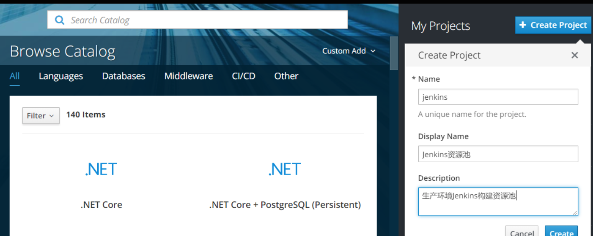
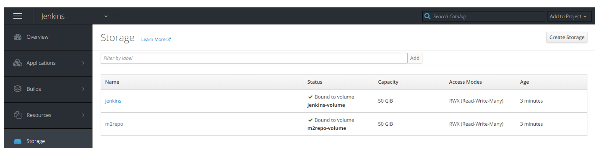
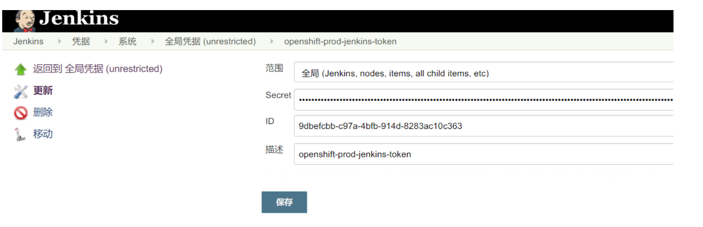
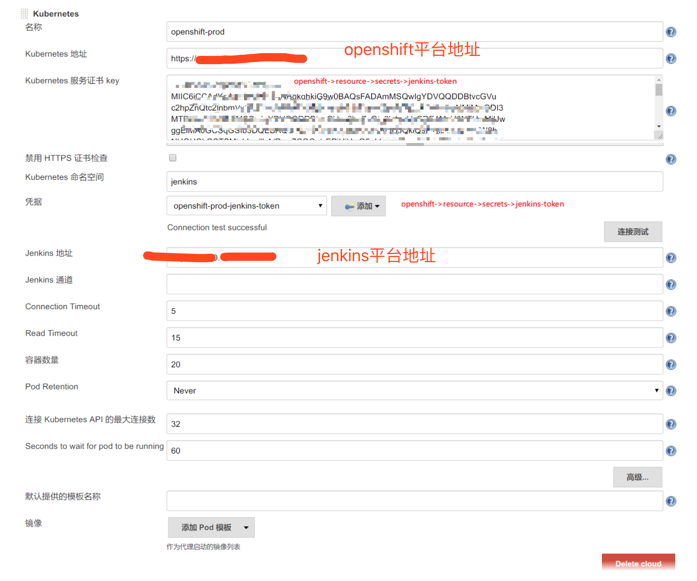

# 基于OpenShift搭建构建资源池


## 网络权限
- OpenShift网络能够链接Jenkins8080端口。
- Jenkins能够访问容器paas平台。


## OpenShift配置
### 1. 持久化数据
配置文件： /etc/exports.d/openshift-ansible.exports

```
#添加内容： 
"/mnt/exports/jenkins" *(rw,root_squash)    #Jenkins workspace
"/mnt/exports/m2repo" *(rw,root_squash)     #Maven Cache

mkdir -p /mnt/exports/jenkins
mkdir -p /mnt/exports/m2repo
chmod 777 -R /mnt/exports/m2repo/
chmod 777 -R /mnt/exports/jenkins/
exportfs -a   #生效配置
```


### 2.创建项目


### 3.创建PV

oc create -f jenkins-pv.yml

```
apiVersion: v1
kind: PersistentVolume
metadata:
  labels:
    pv: jenkins
  name: jenkins-volume
spec:
  accessModes:
  - ReadWriteMany
  capacity:
    storage: 50Gi
  claimRef:
    apiVersion: v1
    kind: PersistentVolumeClaim
    name: jenkins
    namespace: jenkins
  nfs:
    path: /mnt/exports/jenkins
    server: 192.168.0.20
  persistentVolumeReclaimPolicy: Retain
---
apiVersion: v1
kind: PersistentVolume
metadata:
  labels:
    pv: m2repo
  name: m2repo-volume
spec:
  accessModes:
  - ReadWriteMany
  capacity:
    storage: 50Gi
  claimRef:
    apiVersion: v1
    kind: PersistentVolumeClaim
    name: m2repo
    namespace: jenkins
  nfs:
    path: /mnt/exports/m2repo
    server: 192.168.0.20
  persistentVolumeReclaimPolicy: Retain
```

### 4.创建PVC
oc create -f jenkins-pvc.yml

```
apiVersion: v1
kind: PersistentVolumeClaim
metadata:
  name: jenkins
  namespace: jenkins
spec:
  accessModes:
  - ReadWriteMany
  resources:
    requests:
      storage: 50Gi
  volumeName: jenkins-volume
---
apiVersion: v1
kind: PersistentVolumeClaim
metadata:
  name: m2repo
  namespace: jenkins
spec:
  accessModes:
  - ReadWriteMany
  resources:
    requests:
      storage: 50Gi
  volumeName: m2repo-volume
```


### 5.创建RBAC

```
apiVersion: v1
kind: ServiceAccount
metadata:
  name: jenkins
  namespace: jenkins
---
kind: Role
apiVersion: rbac.authorization.k8s.io/v1
metadata:
  namespace: jenkins
  name: jenkins
rules:
  - apiGroups: [""]
    resources: ["pods", "configmaps","namespaces"]
    verbs: ["get","watch","list","create","update","delete","patch"]
  - apiGroups: [""]
    resources: ["pods/exec"]
    verbs: ["get","watch","list","create","update","delete","patch"]
  - apiGroups: [""]
    resources: ["pods/log"]
    verbs: ["get","watch","list"]
  - apiGroups: [""]
    resources: ["secrets"]
    verbs: ["get"]
---
kind: RoleBinding
apiVersion: rbac.authorization.k8s.io/v1
metadata:
  name: jenkins-rb
  namespace: jenkins
subjects:
- kind: ServiceAccount
  name: jenkins
  namespace: jenkins
roleRef:
  kind: Role
  name: jenkins
  apiGroups: rbac.authorization.k8s.io
```

### 6.创建调度标签

```
oc label node node01.abcd.com build-infra=true

```

## Jenkins配置

### 1.创建凭据
登录openshift->jenkins项目->resource->secrets->jenkins-token->然后显示隐藏的数据->复制token->存储到jenkins中。



### 2.配置K8S插件



### 3.创建测试项目
```
//流水线
pipeline{
    agent{
        kubernetes{
            label "${runserver}"
            cloud 'openshift-prod'
            yaml '''
apiVersion: v1
kind: Pod
metadata:
  labels:
    jenkins: slave
  namespace: jenkins
spec:
  containers:
    - name: jnlp
      env:
        - name: JAVA_HOME
          value: /usr/local/jdk1.8.0_121
        - name: M3_HOME
          value: /usr/local/apache-maven-3.5.0
        - name: ANT_HOME
          value: /usr/local/apache-ant-1.9.9
        - name: CLASS_PATH
          value: /usr/local/jdk1.8.0_121/jre/lib/rt.jar:/usr/local/jdk1.8.0_121/jre/lib/dt.jar:/usr/local/jdk1.8.0_121/jre/lib/tools.jar
        - name: PATH
          value: /usr/local/jdk1.8.0_121/bin:/usr/local/sbin:/usr/local/bin:/usr/sbin:/usr/bin:/sbin:/bin:/usr/local/apache-maven-3.5.0/bin:/usr/local/apache-ant-1.9.9/bin:
      image: xxxxxxxx/jenkins/slave:v2
      imagePullPolicy: IfNotPresent
      resources:
        limits:
          cpu: '8'
          memory: 16Gi
        requests:
          cpu: '4'
          memory: 8Gi
      tty: true
      volumeMounts:
        - mountPath: /u02/jenkins
          name: volume-1
        - mountPath: /etc/data/m2repository
          name: volume-2
        - mountPath: /home/jenkins
          name: workspace-volume
      workingDir: /home/jenkins
  nodeSelector:
    build-infra: 'true'
    node-role.kubernetes.io/compute: 'true'
  volumes:
    - name: volume-2
      persistentVolumeClaim:
        claimName: m2repo
    - name: volume-1
      persistentVolumeClaim:
        claimName: jenkins
    - emptyDir: {}
      name: workspace-volume
'''
        }
    }
}

```