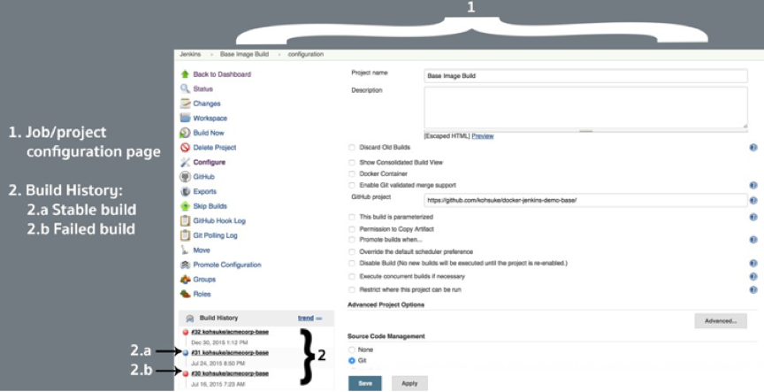
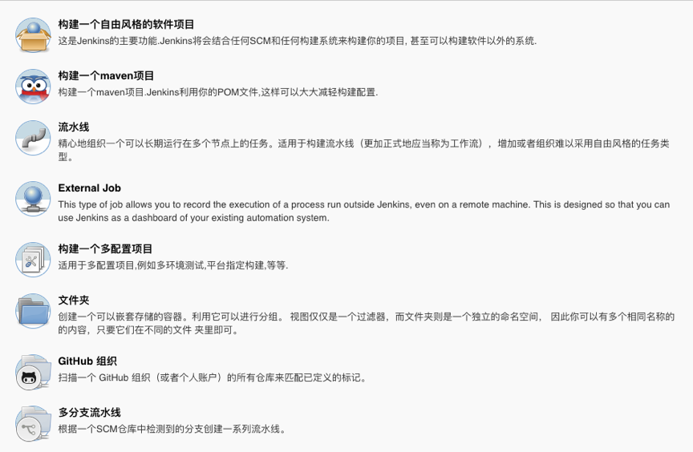

# 第一章 Jenkins简介
## 1. 认识Jenkins    
### 1.1 Jenkins是什么？
[Jenkins官网](http://jenkins.io/) Jenkins前身是Hudson，使用java语言开发的自动化发布工具。在中大型金融等企业中普遍使用Jenkins来作为项目发布工具。 Jenkins官方提供的插件使Jenkins更为强大。

### 1.2 Jenkins特点
- 开源免费
- 多平台支持（windows/linux/macos）
- 主从分布式架构
- 提供web可视化配置管理页面
- 安装配置简单
- 插件资源丰富

### 1.3 Jenkins发展
Jenkins的前身是Hudson，采用JAVA编写的持续集成开源工具。Hudson由Sun公司在2004年启动，第一个版本于2005年在java.net发布。2007年开始Hudson逐渐取代CruiseControl和其他的开源构建工具的江湖地位。在2008年的JavaOne大会上在开发者解决方案中获得杜克选择大奖（Duke's Choice Award）。

在2010年11月期间，因为Oracle对Sun的收购带来了Hudson的所有权问题。主要的项目贡献者和Oracle之间，尽管达成了很多协议，但有个关键问题就是商标名称“Hudson”。甲骨文在2010年12月声明拥有该名称并申请商标的权利。 因此，2011年1月11日，有人要求投票将项目名称从“Hudson”改为“Jenkins”。2011年1月29日，该建议得到社区投票的批准，创建了Jenkins项目。

2011年2月1日，甲骨文表示，他们打算继续开发Hudson，并认为Jenkins只是一个分支，而不是重命名。因此，Jenkins和Hudson继续作为两个独立的项目，每个都认为对方是自己的分支。到2013年12月，GitHub上的Jenkins拥有567个项目成员和约1,100个公共仓库，与此相对的Hudson有32个项目成员和17个公共仓库。到现在两者的差异更多，应该说Jenkins已经全面超越了Hudson。此外，大家可能是出于讨厌Oracle的情绪，作为Java开发者天然地应该支持和使用Jenkins。

## 2. Jenkins WebUI
### 2.1 管理页面
系统管理页面包含系统管理、全局安全管理、全局工具配置、节点管理、授权管理、插件管理、系统备份管理、日志监控管理

### 2.2 项目管理页面

### 2.3 构建输出页面

## 3. Jenkins构建
### 3.1 Jenkins项目类型

### 3.2 Jenkins参数类型
凭据参数、字符参数、密码参数、布尔值参数、文件参数、文本参数、运行时参数、选项参数

### 3.3 Jenkins触发器

### [下一章](./第二章-安装Jenkins.md)       <--------->  [首页](../README.md) 