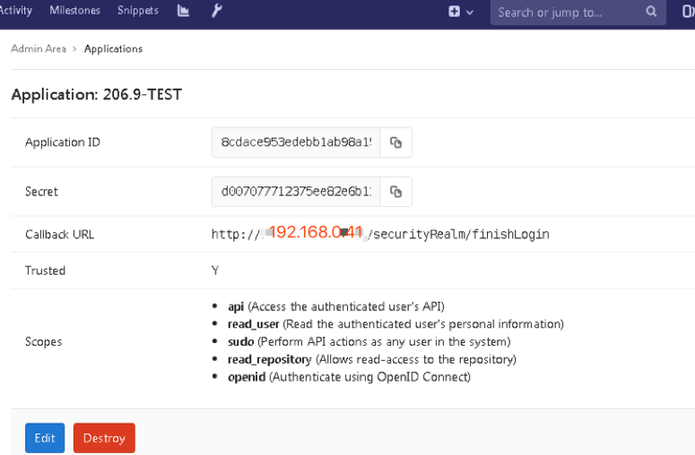
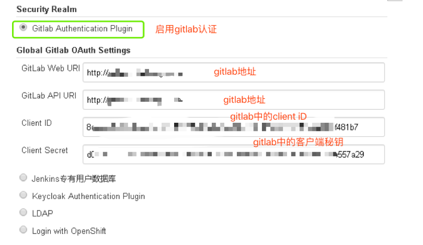
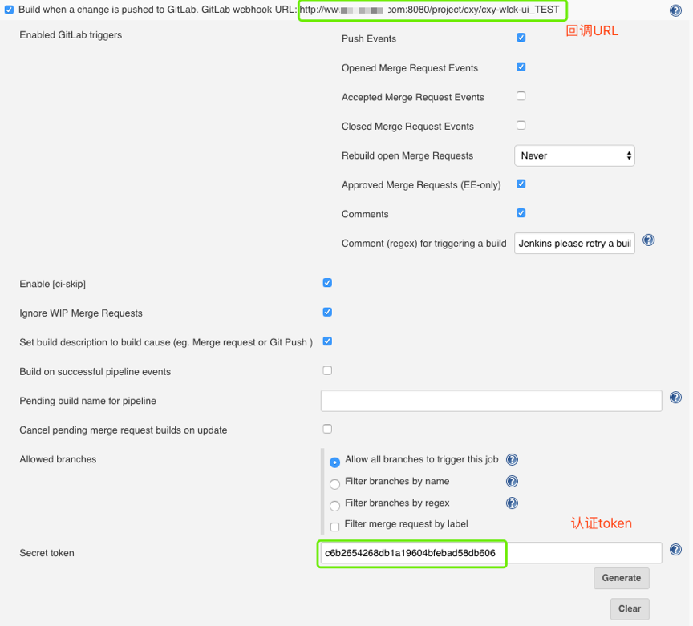
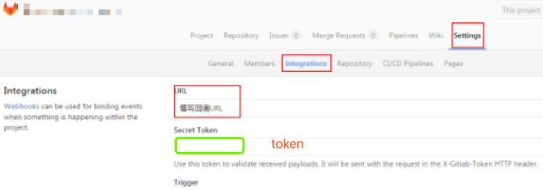

# 第四章 Jenkins集成Gitlab
## 1. SSO集成

### 1.1 Gitlab配置
- 应用管理->创建应用->配置重定向url

### 1.2 Jenkins配置
- 配置前备份config.xml文件，
- 如果jenkins前面有代理需要改一下upstream名称，因为这个名称会自动填充为redirect_url地址。

## 2. WebHook集成

### 2.1 Jenkins配置

- 安装gitlab hook插件

- 选择一个项目，在构建触发器模块选择通过gitlab触发。生成token

### 2.2 Gitlab配置
- 进入项目-> 项目设置-> 集成

- 保存后测试连接

- 返回成功信息，此时可以查看jenkins项目是否正在building。

### [下一章](./第八章-集成Jenkins(四).md)    <--------->  [上一章](./第六章-集成Jenkins(二).md)