# 第三章 管理Jenkins（项目、视图、插件）
## 1. 项目管理

### 1.1 命名规范
- 业务名称-应用名称-应用类型_环境类型： cxy-wlck-ui_TEST, 只有命名规范才方便管理项目。

### 1.2 新建项目
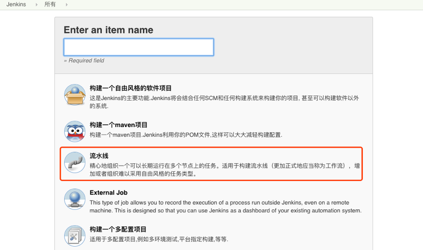

- 设置构建历史

- 选择参数化构建
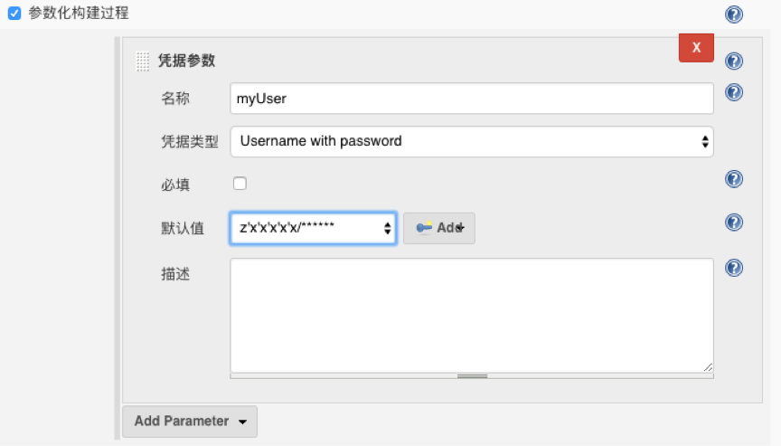

- 设置构建触发器
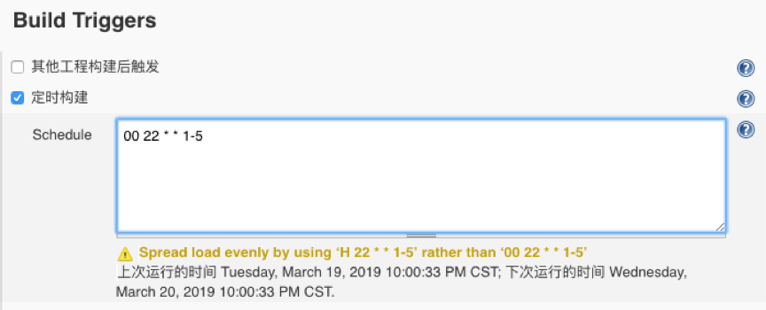

- 设置Jenkinsfile

- 构建项目

- 查看构建日志

- 调试Pipeline
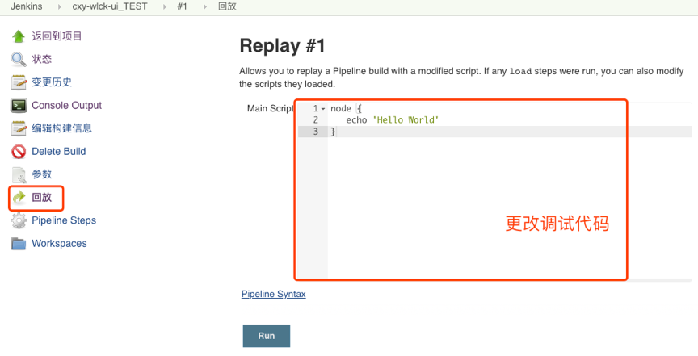

### 1.3 删除/禁用项目
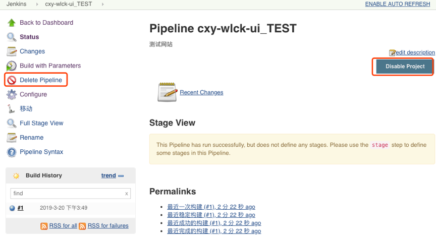

### 1.4 项目分类
- 以业务简称为名，创建工程文件夹。将同一个业务的工程全部放到同一个文件夹中。
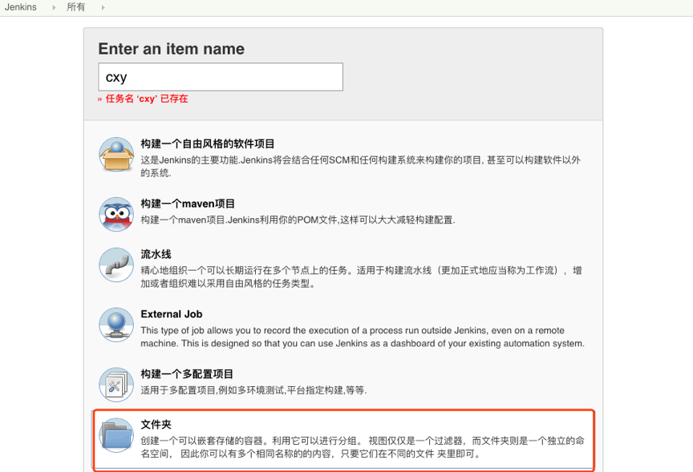

- 移动项目
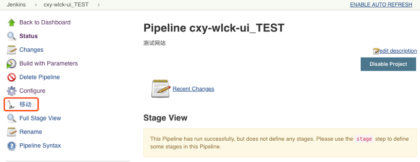
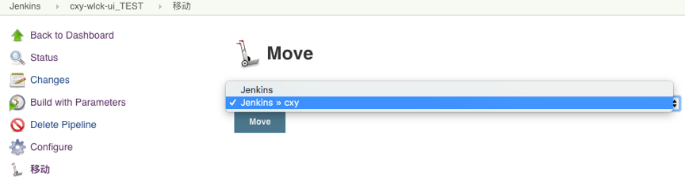

- 外部
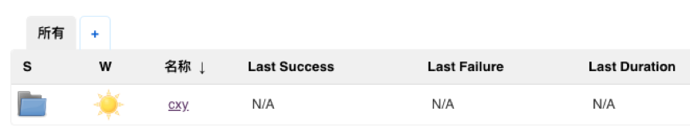

- 内部
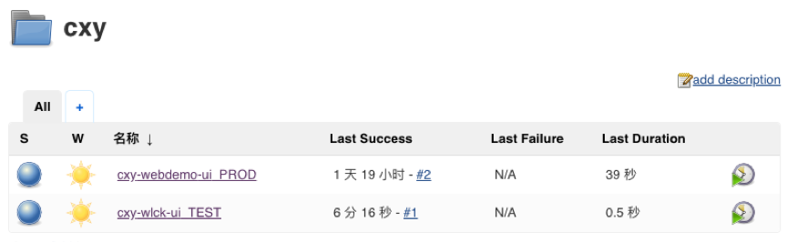

## 2. 视图管理
- 默认会创建一个all视图里面存放所有的项目。

### 2.1 创建视图
- 凭据-> 系统-> 全局凭据
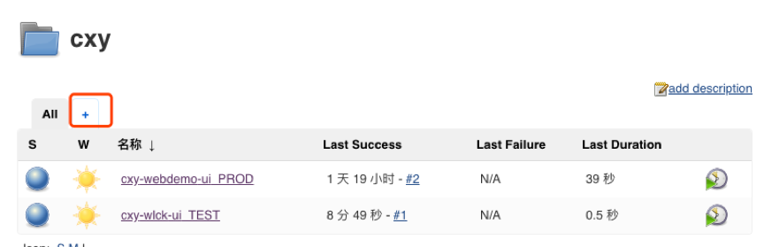
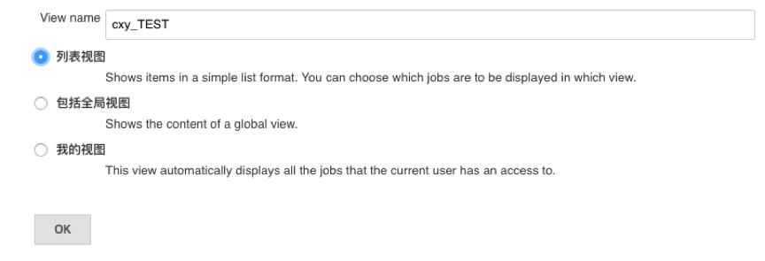

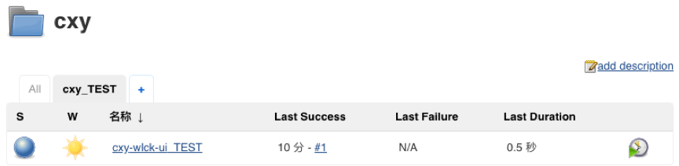

### 2.2 删除视图
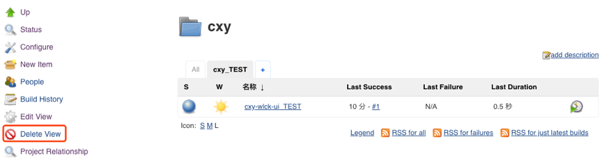

### 2.3 更新视图

## 3. 插件管理
-  系统设置->插件管理。
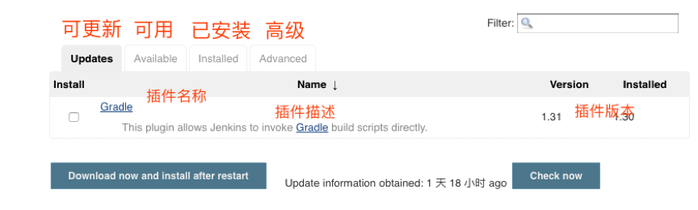

### 3.1 安装插件
- 勾选要安装的插件，选择安装后不重启。（有些插件需要安装后重启）

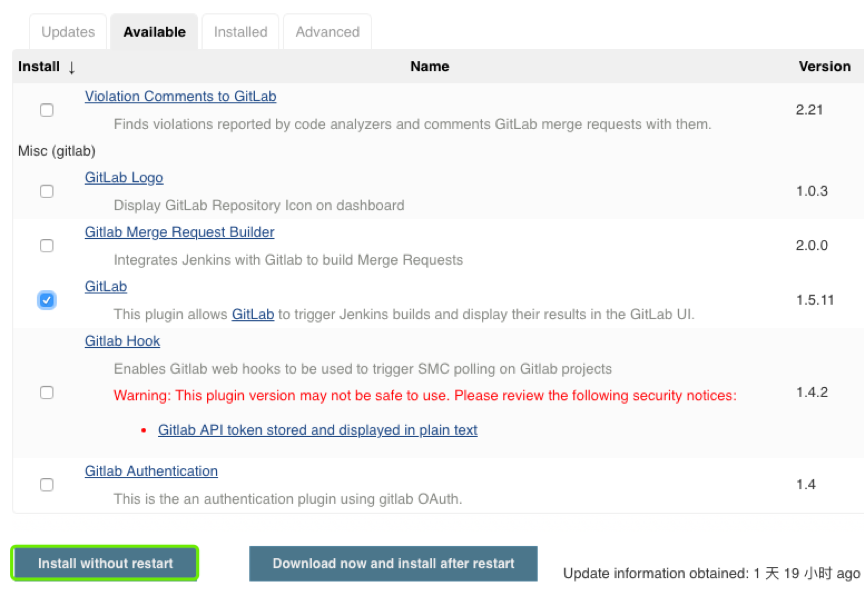

- 安装
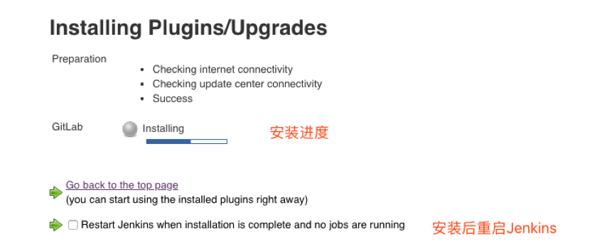

### 3.2 卸载插件

### 3.3 上传插件
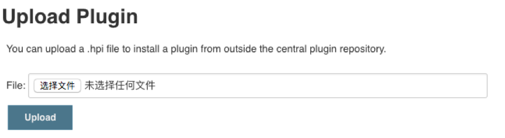

### 3.4 切换插件更新站点
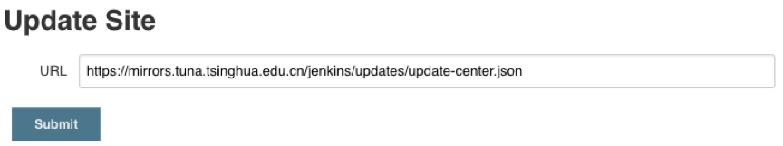

### [下一章](./第五章-集成Jenkins(一).md)       <--------->  [上一章](./第三章-管理Jenkins(一).md)