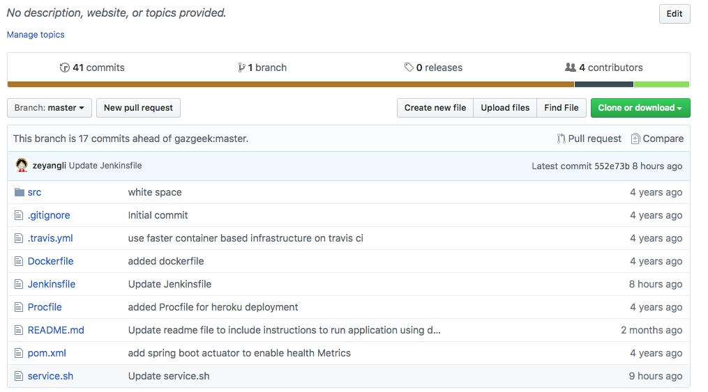

# JAVA Springboot项目发布

demo地址: https://github.com/zeyangli/springboot-helloworld.git



## 创建Jenkins项目
- serviceName: 服务的名称
- buildShell : 项目打包命令
- targetHosts: 应用发布主机（需安装salt-minion）
- targetDir: 应用的发布目录
- user: 发布用户
- port: 应用的启动端口


## Jenkinsfile


```
String buildShell = "${env.buildShell}"
String targetHosts = "${env.targetHosts}"
String targetDir = "${env.targetDir}"
String serviceName = "${env.serviceName}"
String user = "${env.user}"
String port = "${env.port}"
def jarName

node("master"){
    //检出代码
    stage("checkout"){
        checkout scm
    }
    
    //执行构建
    stage("build"){
        def mvnHome = tool 'M3'
        sh " ${mvnHome}/bin/mvn ${buildShell} "
        
        jarName = sh returnStdout: true, script: "cd target && ls *.jar"
        jarName = jarName - "\n"
        //归档制品
        sh "mkdir -p /srv/salt/${serviceName} && mv  service.sh target/${jarName} /srv/salt/${serviceName} "
    }
    
    //发布应用
    stage("deploy"){
        sh " salt ${targetHosts} cmd.run ' rm -fr  ${targetDir}/*.jar '"
        sh " salt ${targetHosts} cp.get_file salt://${serviceName}/${jarName}  ${targetDir}/${jarName} mkdirs=True"
        sh " salt ${targetHosts} cp.get_file salt://${serviceName}/service.sh  ${targetDir}/service.sh mkdirs=True"
        sh " salt ${targetHosts} cmd.run 'chown ${user}:${user} ${targetDir} -R '"
        sh " salt ${targetHosts} cmd.run 'su - ${user} -c \"cd ${targetDir} &&  sh service.sh stop\" ' "
        sh " salt ${targetHosts} cmd.run 'su - ${user} -c \"cd ${targetDir} &&  sh service.sh start ${jarName} ${port} ${targetDir}\" ' "
    }


}


```

## 服务启动脚本

```
#!/bin/bash

app=$2
port=$3
targetDir=$4

start(){
    cd ${targetDir}
    nohup java -jar ${app} --server.port=${port} >>/dev/null 2>&1& echo $! > service.pid
    cd -
    
}

stop(){
    pid=`cat service.pid`
    if [ -z $pid ]
    then 
        echo "pid"
    else
        kill -9 ${pid}
        kill -9 ${pid}
        kill -9 ${pid}
    fi
}

case $1 in
	start)
	    start
	    ;;
	stop)
	    stop
	    ;;
	    
	restart)
	    stop
	    sleep 5
	    start
	    ;;
	*)
	    echo "[start|stop|restart]"
	    ;;
    
esac
```


## 构建日志


```
Started by user admin
Obtained Jenkinsfile from git https://github.com/zeyangli/springboot-helloworld.git
Running in Durability level: MAX_SURVIVABILITY
[Pipeline] Start of Pipeline
[Pipeline] node
Running on Jenkins in /var/lib/jenkins/workspace/demo/demo-springboot-service
[Pipeline] {
[Pipeline] stage
[Pipeline] { (checkout)
[Pipeline] checkout
using credential 24982560-17fc-4589-819b-bc5bea89da77
 > /root/bin/git rev-parse --is-inside-work-tree # timeout=10
Fetching changes from the remote Git repository
 > /root/bin/git config remote.origin.url https://github.com/zeyangli/springboot-helloworld.git # timeout=10
Fetching upstream changes from https://github.com/zeyangli/springboot-helloworld.git
 > /root/bin/git --version # timeout=10
using GIT_ASKPASS to set credentials gitlab
 > /root/bin/git fetch --tags --progress https://github.com/zeyangli/springboot-helloworld.git +refs/heads/*:refs/remotes/origin/*
 > /root/bin/git rev-parse refs/remotes/origin/master^{commit} # timeout=10
 > /root/bin/git rev-parse refs/remotes/origin/origin/master^{commit} # timeout=10
Checking out Revision 552e73b0d8c9ef58f131b57f8e35c436f272ce14 (refs/remotes/origin/master)
 > /root/bin/git config core.sparsecheckout # timeout=10
 > /root/bin/git checkout -f 552e73b0d8c9ef58f131b57f8e35c436f272ce14
Commit message: "Update Jenkinsfile"
 > /root/bin/git rev-list --no-walk 974b431aa8579f896e182e34d1b6fba895129b7d # timeout=10
[Pipeline] }
[Pipeline] // stage
[Pipeline] stage
[Pipeline] { (build)
[Pipeline] tool
[Pipeline] sh
+ /usr/local/apache-maven-3.6.0/bin/mvn clean install -DskipTests
[INFO] Scanning for projects...
[INFO] 
[INFO] -----------------------< com.gazgeek:helloworld >-----------------------
[INFO] Building helloworld 0.0.1-SNAPSHOT
[INFO] --------------------------------[ jar ]---------------------------------
[INFO] 
[INFO] --- maven-clean-plugin:2.5:clean (default-clean) @ helloworld ---
[INFO] Deleting /var/lib/jenkins/workspace/demo/demo-springboot-service/target
[INFO] 
[INFO] --- jacoco-maven-plugin:0.7.2.201409121644:prepare-agent (prepare-agent) @ helloworld ---
[INFO] argLine set to -javaagent:/root/.m2/repository/org/jacoco/org.jacoco.agent/0.7.2.201409121644/org.jacoco.agent-0.7.2.201409121644-runtime.jar=destfile=/var/lib/jenkins/workspace/demo/demo-springboot-service/target/jacoco.exec
[INFO] 
[INFO] --- maven-resources-plugin:2.6:resources (default-resources) @ helloworld ---
[INFO] Using 'UTF-8' encoding to copy filtered resources.
[INFO] Copying 1 resource
[INFO] Copying 0 resource
[INFO] 
[INFO] --- maven-compiler-plugin:3.1:compile (default-compile) @ helloworld ---
[INFO] Changes detected - recompiling the module!
[INFO] Compiling 2 source files to /var/lib/jenkins/workspace/demo/demo-springboot-service/target/classes
[INFO] 
[INFO] --- maven-resources-plugin:2.6:testResources (default-testResources) @ helloworld ---
[INFO] Using 'UTF-8' encoding to copy filtered resources.
[INFO] skip non existing resourceDirectory /var/lib/jenkins/workspace/demo/demo-springboot-service/src/test/resources
[INFO] 
[INFO] --- maven-compiler-plugin:3.1:testCompile (default-testCompile) @ helloworld ---
[INFO] Changes detected - recompiling the module!
[INFO] Compiling 3 source files to /var/lib/jenkins/workspace/demo/demo-springboot-service/target/test-classes
[INFO] 
[INFO] --- maven-surefire-plugin:2.17:test (default-test) @ helloworld ---
[INFO] Tests are skipped.
[INFO] 
[INFO] --- maven-jar-plugin:2.5:jar (default-jar) @ helloworld ---
[INFO] Building jar: /var/lib/jenkins/workspace/demo/demo-springboot-service/target/helloworld-0.0.1-SNAPSHOT.jar
[INFO] 
[INFO] --- spring-boot-maven-plugin:1.2.2.RELEASE:repackage (default) @ helloworld ---
[INFO] 
[INFO] --- maven-install-plugin:2.5.2:install (default-install) @ helloworld ---
[INFO] Installing /var/lib/jenkins/workspace/demo/demo-springboot-service/target/helloworld-0.0.1-SNAPSHOT.jar to /root/.m2/repository/com/gazgeek/helloworld/0.0.1-SNAPSHOT/helloworld-0.0.1-SNAPSHOT.jar
[INFO] Installing /var/lib/jenkins/workspace/demo/demo-springboot-service/pom.xml to /root/.m2/repository/com/gazgeek/helloworld/0.0.1-SNAPSHOT/helloworld-0.0.1-SNAPSHOT.pom
[INFO] ------------------------------------------------------------------------
[INFO] BUILD SUCCESS
[INFO] ------------------------------------------------------------------------
[INFO] Total time:  5.497 s
[INFO] Finished at: 2019-04-05T07:41:23+08:00
[INFO] ------------------------------------------------------------------------
[Pipeline] sh
+ cd target
+ ls helloworld-0.0.1-SNAPSHOT.jar
[Pipeline] sh
+ mkdir -p /srv/salt/demo-springboot-service
+ mv service.sh target/helloworld-0.0.1-SNAPSHOT.jar /srv/salt/demo-springboot-service
[Pipeline] }
[Pipeline] // stage
[Pipeline] stage
[Pipeline] { (deploy)
[Pipeline] sh
+ salt VM_0_12_centos cmd.run ' rm -fr  /opt/javatest/*.jar '
VM_0_12_centos:
[Pipeline] sh
+ salt VM_0_12_centos cp.get_file salt://demo-springboot-service/helloworld-0.0.1-SNAPSHOT.jar /opt/javatest/helloworld-0.0.1-SNAPSHOT.jar mkdirs=True
VM_0_12_centos:
    /opt/javatest/helloworld-0.0.1-SNAPSHOT.jar
[Pipeline] sh
+ salt VM_0_12_centos cp.get_file salt://demo-springboot-service/service.sh /opt/javatest/service.sh mkdirs=True
VM_0_12_centos:
    /opt/javatest/service.sh
[Pipeline] sh
+ salt VM_0_12_centos cmd.run 'chown tomcat:tomcat /opt/javatest -R '
VM_0_12_centos:
[Pipeline] sh
+ salt VM_0_12_centos cmd.run 'su - tomcat -c "cd /opt/javatest &&  sh service.sh stop" '
VM_0_12_centos:
[Pipeline] sh
+ salt VM_0_12_centos cmd.run 'su - tomcat -c "cd /opt/javatest &&  sh service.sh start helloworld-0.0.1-SNAPSHOT.jar 8080 /opt/javatest" '
VM_0_12_centos:
    /opt/javatest
[Pipeline] }
[Pipeline] // stage
[Pipeline] }
[Pipeline] // node
[Pipeline] End of Pipeline
Finished: SUCCESS

```