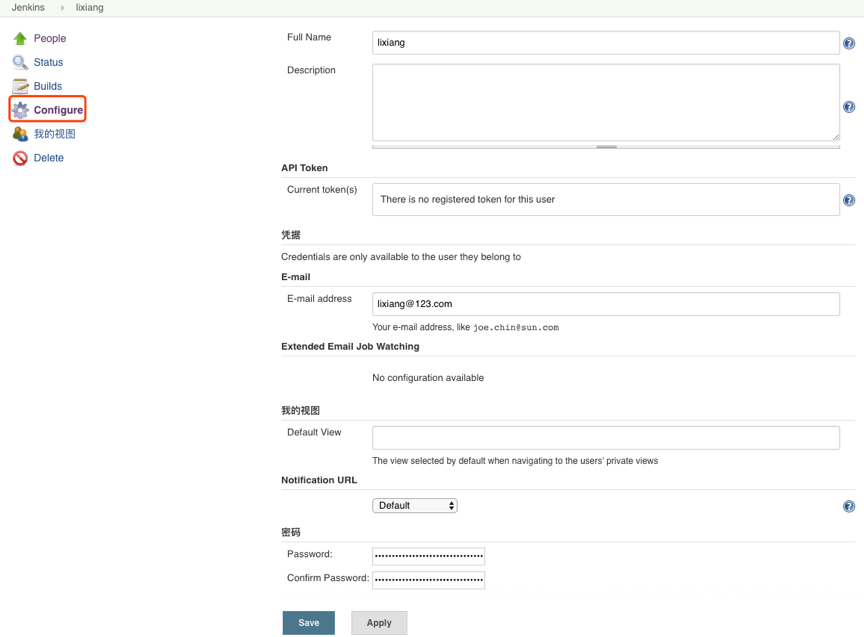
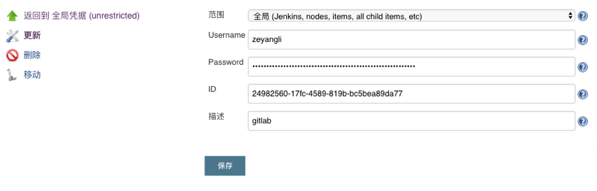

# 第三章 管理Jenkins（用户、凭据、权限）
## 1. 用户管理
- 配置用户接入入口: 系统管理->全局安全配置。
- 默认使用的是Jenkins数据库存储。
- 可以选择集成LDAP服务或者是GItlab服务（需要安装插件后才会有）。

### 1.1 查看用户
- 以使用Jenkins专有数据库为例，用户管理入口: 系统管理-> 管理用户

### 1.2 创建用户

### 1.3 删除用户

### 1.4 更新用户

## 2. 凭据管理
- 凭据可以用来存储需要密文保护的数据库密码、Gitlab密码信息。
- 凭据类型：

### 2.1 查看凭据
- 凭据-> 系统-> 全局凭据

### 2.2 新建凭据

### 2.3 删除凭据

### 2.4 更新凭据

### 2.5 移动凭据
- 凭据支持多个域，支持将凭据移动到其他域中。

## 3. 权限管理
- 权限默认使用 Role-Based Strategy,其他方式如图所示。

### 3.1 管理权限
- 系统设置->Manage and Assign Roles->Manage Roles
- Global roles：添加用户和用户组，分配某个用户属于哪个用户组。
- Project roles：添加某个工程或某一组工程的用户或用户组
- Slave roles：添加某个节点或某一组节点的用户或用户组

### 3.2 全局权限
凭据参数、字符参数、密码参数、布尔值参数、文件参数、文本参数、运行时参数、选项参数

### 3.3 项目权限

### 3.4 权限授权
- 系统设置->Manage and Assign Roles->Assign Roles

### [下一章](./第四章-管理Jenkins(二).md)       <--------->  [上一章](./第二章-安装Jenkins.md)