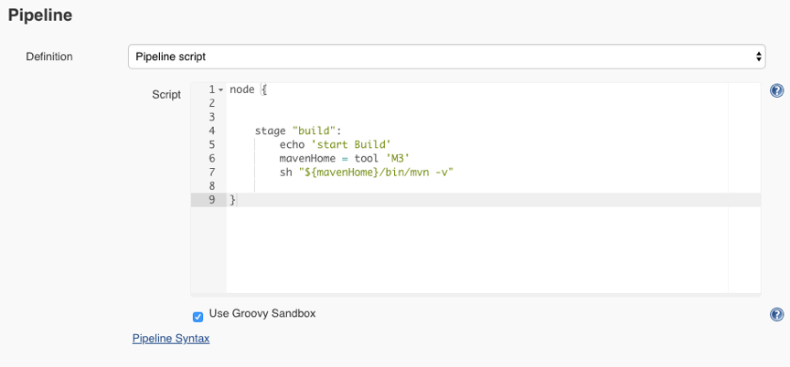

# 第五章 流水线基础-Pipeline
## 1. 认识Pipleine

### 1.1 Pipeline是什么？

- Pipeline是Jenkins的核心功能，提供一组可扩展的工具。
- 通过Pipeline 的DSL语法可以完成从简单到复杂的交付流水线实现。
- jenkins的Pipeline是通过Jenkinsfile（文本文件）来实现的。
- 这个文件可以定义Jenkins的执行步骤，例如检出代码。

### 1.2 Jenkinsfile

- Jenkinsfile使用两种语法进行编写，分别是声明式和脚本式。
- 声明式和脚本式的流水线从根本上是不同的。
- 声明式是jenkins流水线更友好的特性。
- 脚本式的流水线语法，提供更丰富的语法特性。
- 声明式流水线使编写和读取流水线代码更容易设计。


### 1.3 为什么使用Pipeline？

本质上，jenkins是一个自动化引擎，它支持许多自动模式。流水线向Jenkins添加了一组强大的工具，支持用例、简单的持续集成到全面的持续交付流水线。
通过对一系列的发布任务建立标准的模板，用户可以利用更多流水线的特性，比如：

- 代码化: 流水线是在代码中实现的，通常会存放到源代码控制，使团队具有编辑、审查和更新他们项目的交付流水线的能力。
- 耐用性：流水线可以从Jenkins的master节点重启后继续运行。
- 可暂停的：流水线可以由人功输入或批准继续执行流水线。
- 解决复杂发布： 支持复杂的交付流程。例如循环、并行执行。
- 可扩展性： 支持扩展DSL和其他插件集成。 

构建一个可扩展是Jenkins的核心价值，流水线可以通过ShareLibrary的方式来扩展。
下面是一个CD的场景实例


## 2. Pipeline概念
参考文档：https://jenkins.io/zh/doc/book/pipeline/ 
### 2.1 node/agent(节点)
节点是一个机器，可以是Jenkins的master节点也可以是slave节点。通过node指定当前job运行的机器（这个是脚本式语法）。

- 声明式Pipeline: 使用agent指定运行的slave节点可以是label。

```
pipeline{
    agent any
    stages{
       //    
    }

}

```

- 脚本式Pipleine： 使用node指定运行slave可以是label。

```
node("slave"){
    stage("GetCode"){
        //
    }
}
```

### 2.2 stage(阶段)
stage定义了在整个流水线的执行任务的概念性的不同的阶段。例如： GetCode、Build、Test、Deploy、CodeScan每个阶段。

- 声明式pipeline： 定义stages->stage。

```
pipeline{
    agent any
    stages{
        stage("GetCode"){
            //steps  
        }
        
        stage("build"){
           //step
        }
    
    }

}

```

- 脚本式Pipeline: 直接使用stage。

```
node("slave"){
    stage("GetCode"){
        //
    }
    
    stage("build"){
        //
    }
}

```

### 2.3 step(步骤)
step是每个阶段中要执行的每个步骤。例如： 在执行GetCode的时候需要判断用户提供的参数srcType的值是Git还是svn。

- 声明式Pipeline: stage->steps。

```
pipeline{
    agent any
    stages{
        stage("GetCode"){
            steps{ 
                sh "ls "    //step
            }
        
        }    
    }

}

```

- 脚本式Pipeline： 不需要step关键字。

```
node("slave"){
    stage("GetCode"){
        //step
        if("${srcType}" == "Git"){
            //用git方式代码检出
        } else if ("${srcType}" == "SVN"){
            //用svn方式代码检出
        } else {
            error "srcType is not in [Git|SVN]"
        }
    }
}

```

## 3. Jenkinsfile生成与管理
### 3.1 BlueOcean（生成）
如果你是新手，Blue Ocean可以帮助你设置流水线，通过图形化流水线编辑器自动创建和编写Jenkinsfile。（需要安装blueocean 插件）


### 3.2 WEBUI（管理）
项目->配置



### 3.3 SCM（管理）
Jenkinsfile编写完成后上传到gitlab进行版本控制。


使用时，通过项目的配置gitlab仓库地址和分支信息以及文件名称信息。


### [下一章](./第十章-流水线实践(二).md)    <--------->  [上一章](./第八章-集成Jenkins(四).md)