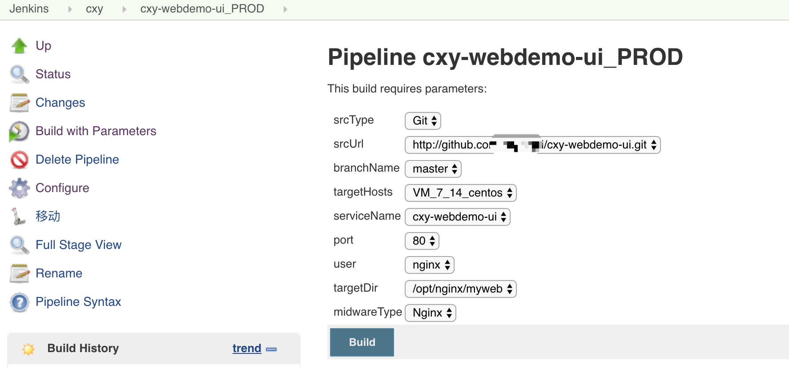
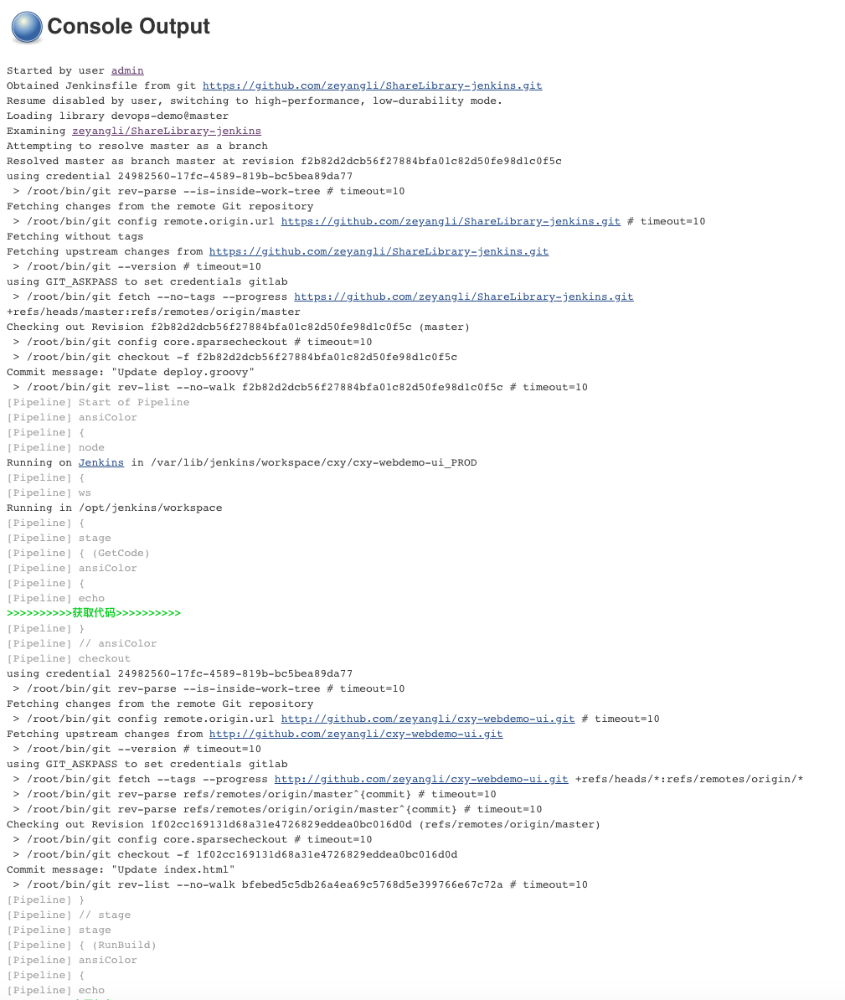

# 第六章 前端发布流水线（静态资源）
## 1. 项目设置
项目配置部分主要是将网站源代码上传到github，然后搭建用户访问的web服务器。再经过Jenkins配置发布代码到web服务器。

### 1.1 项目代码托管

- 将项目源代码上传到GitHub


### 1.2 搭建前端Nginx服务

- 安装Nginx服务 

```
yum -y install nginx 
service nginx start 
chkconfig nginx on
```

- 创建站点目录

```
mkdir -p /opt/nginx/myweb

```

- 配置Nginx

```
vim /etc/nginx/conf.d/default.conf

server {
    listen       80 default_server;
    server_name  www.xxxxx.com;

    include /etc/nginx/default.d/*.conf;

    location / {
        root /opt/nginx/myweb;
        index index.html ;
    }
    
    error_page 404 /404.html;
        location = /40x.html {
    }

    error_page 500 502 503 504 /50x.html;
        location = /50x.html {
    }

}

service nginx restart

```


## 2. Jenkins配置

### 2.1 创建项目
- 业务名称: cxy
- 应用名称: cxy-webdemo-ui
- 应用服务器: VM_7_14_centos
- 站点目录: /opt/nginx/myweb
- 服务端口: 80
- 发布用户: nginx
- 发布分支: master
- 项目地址: http://github.com/xxxx/cxy-webdemo-ui.git




### 2.2 编写Jenkinsfile（ShareLibrary）
- ShareLibrary 目录结构


- Jenkinsfile

```
#!groovy
@Library('devops-demo') _          //导入sharelibrary

def tools = new org.devops.tools()    


//Getcode
String srcUrl = "${env.srcUrl}".trim()
String srcType = "${env.srcType}".trim()
String branchName = "${env.branchName}".trim()
String tagName = "${env.tagName}".trim()
String moduleName = "${env.moduleName}".trim()

//Global 
String workspace = "/opt/jenkins/workspace"
String targetHosts = "${env.targetHosts}".trim()
String jobType = "${JOB_NAME}".split('_')[-1]
String credentialsId = "24982560-17fc-4589-819b-bc5bea89da77"
String serviceName = "${env.serviceName}".trim()
String javaVersion = "${env.javaVersion}".trim()
String dependency = "${env.dependency}".trim()
String port = "${env.port}".trim()
String user = "${env.user}".trim()
String targetDir = "${env.targetDir}".trim()
def runserver 
def buildDir = tools.BuildDir(workspace,srcType,tagName,moduleName)[0]  
def srcDir = tools.BuildDir(workspace,srcType,tagName,moduleName)[1]  

//Build
String midwareType = "${env.midwareType}".trim()
String buildType = "${env.buildType}".trim()
String buildShell = "${env.buildShell}".trim()

//Pipeline

ansiColor('xterm') {
    node("master"){
        ws("${workspace}") {
            //Getcode
            stage("GetCode"){
                tools.PrintMes('获取代码','green')
                try {
                    def getcode = new org.devops.getcode()
                    getcode.GetCode(srcType,srcUrl,tagName,branchName,credentialsId)
                } catch(e){
                
                }    
            }
            
            //Build
            stage("RunBuild"){
                tools.PrintMes('应用打包','green')
                def build = new org.devops.build()
        
                try {
                    if ("${midwareType}" == "Nginx"){
                        build.WebBuild(srcDir,serviceName)
                    
                    } else if ("${midwareType}" == "NodeJs"){
                        def webDist=srcDir + '/dist'
                        sh " cd ${srcDir} && ${buildShell} && cd -"
                        build.WebBuild(webDist,serviceName)
                    }
                    else {
                        build.Build(javaVersion,buildType,buildDir,buildShell)
                    }
                }catch(e){
                    currentBuild.description='运行打包失败！'
                    error '运行打包失败！'
                }
            }
            
            
            //Deploy
            stage("RunDeploy"){
                tools.PrintMes('发布应用','green')
                def deploy = new org.devops.deploy()
                
                switch("${midwareType}"){
                    case 'SpringBoot':
                        deploy.SpringBootInit(javaOption,dependency,credentialsId)
                        deploy.JavaDeploy('SpringBoot','jar',srcDir,user,targetHosts,targetDir+"/${serviceName}",port)
                        break;
                        
                    case 'Tomcat':
                        def tomcatDir=targetDir + "/${port}/webapps/"
                        deploy.JavaDeploy('Tomcat','war',srcDir,user,targetHosts,tomcatDir,port)
                        break;
                        
                    case 'NodeJs':
                        deploy.WebDeploy(user,serviceName,targetDir)
                        break;

                    case 'Nginx': 
                        deploy.WebDeploy(user,serviceName,targetDir)
                        break;

                    default:
                        error "中间件类型错误!"  
                }
            }
        }
    
    }
}
```

- org/src/devops/build.groovy

```
package org.devops

//构建打包
def Build(javaVersion,buildType,buildDir,buildShell){
    if (buildType == 'maven'){
        Home = tool '/usr/local/apache-maven'
        buildHome = "${Home}/bin/mvn"
    } else if (buildType == 'ant'){
        Home = tool 'ANT'
        buildHome = "${Home}/bin/ant"
    } else if (buildType == 'gradle'){
        buildHome = '/usr/local/bin/gradle'
    } else{
        error 'buildType Error [maven|ant|gradle]'
    }
    echo "BUILD_HOME: ${buildHome}"
    
    //选择JDK版本
    jdkPath = ['jdk7' : '/usr/local/jdk1.7.0_79',
               'jdk6' : '/usr/local/jdk1.6.0_45',
               'jdk8' : '/usr/java/jdk1.8.0_111',
               'jdk11': '/usr/local/jdk-11.0.1',
               'null' : '/usr/java/jdk1.8.0_111']
    def javaHome = jdkPath["$javaVersion"]
    if ("$javaVersion" == 'jdk11'){
       sh  """
        export JAVA_HOME=${javaHome}
        export PATH=\$JAVA_HOME/bin:\$PATH
        java -version
        cd ${buildDir} && ${buildHome} ${buildShell}
        """
    } else {
        sh  """
            export JAVA_HOME=${javaHome}
            export PATH=\$JAVA_HOME/bin:\$PATH
            export CLASSPATH=.:\$JAVA_HOME/lib/dt.jar:\$JAVA_HOME/lib/tools.jar
            java -version
            cd ${buildDir} && ${buildHome} ${buildShell}
            """
    }
}


//前端Build
def WebBuild(srcDir,serviceName){
    def deployPath = "/srv/salt/${JOB_NAME}"
    sh """
        [ -d ${deployPath} ] || mkdir -p ${deployPath}
        cd ${srcDir}/
        rm -fr *.tar.gz 
        tar zcf ${serviceName}.tar.gz * 
        cp ${serviceName}.tar.gz ${deployPath}/${serviceName}.tar.gz
        cd -
    """
}
```

- org/src/devops/codescan.groovy

```
package org.devops


//代码扫描
def SonarScan(projectType,skipSonar,srcDir,serviceName,scanDir){
    def scanHome = "/usr/local/sonar-scanner"
    if (projectType == 'java'){
        if ("${buildType}" == 'gradle'){
            codepath = 'build/classes'
        } else{
            codepath = 'target/classes'
        }
        try {
            sh """
                cd ${srcDir} 
                ${scanHome}/bin/sonar-scanner -Dsonar.projectName=${serviceName} -Dsonar.projectKey=${serviceName}  \
                -Dsonar.sources=.  -Dsonar.language=java -Dsonar.sourceEncoding=UTF-8 \
                -Dsonar.java.binaries=${codepath} -Dsonar.java.coveragePlugin=jacoco \
                -Dsonar.jacoco.reportPath=target/jacoco.exec -Dsonar.junit.reportsPath=target/surefire-reports \
                -Dsonar.surefire.reportsPath=target/surefire-reports -Dsonar.projectDescription='devopsdevops'
             """ 
        } catch (e){
            currentBuild.description="代码扫描失败!"
            error '代码扫描失败!'
        }
    } else if (projectType == 'web'){
        try {
            sh  """
                cd ${srcDir} 
                ${scanHome}/bin/sonar-scanner -Dsonar.projectName=${serviceName} \
                -Dsonar.projectKey=${serviceName} -Dsonar.sources=${scanDir} -Dsonar.language=js  
                cd - 
                """
        } catch (e){
            currentBuild.description="代码扫描失败!"
            error '代码扫描失败!'
        }
    }
}
```

- org/src/devops/deploy.groovy

```
package org.devops


//saltapi模板
def Salt(salthost,saltfunc,saltargs) {
    /*result = salt(authtype: 'pam', 
                clientInterface: local( arguments: saltargs,
                                        function: saltfunc, 
                                        target: salthost, 
                                        targettype: 'list'),
                credentialsId: "f89abde3-49f0-4b75-917e-c4e49c483f4f", 
                servername: "http://127.0.0.1:9000")*/
    
    sh """
        salt ${salthost} ${saltfunc} ${saltargs}
        """
    //println(result)
    //PrintMes(result,'blue')
    //return  result
}


//前端类型发布
def WebDeploy(user,serviceName,targetDir){
    try {
        println('清空发布目录')
        
        Salt(targetHosts,'cmd.run', "cmd=\" rm -fr  ${targetDir}/* \"")
        
        println('发布软件包')
        Salt(targetHosts,'cp.get_file', "salt://${JOB_NAME}/${serviceName}.tar.gz ${targetDir}/${serviceName}.tar.gz makedirs=True ")
        sleep 2;
        
        println('解压')
        Salt(targetHosts,'cmd.run', "cmd=\" cd ${targetDir} && tar zxf ${serviceName}.tar.gz  \"")
        sleep 2;
        
        println('授权')
        Salt(targetHosts,'cmd.run', "cmd=\"chown ${user}:${user} ${targetDir} -R  \"")
        sleep 2;
        println('获取发布文件')
        Salt(targetHosts,'cmd.run', "cmd=\" ls -l  ${targetDir} \"")
        
        println('删除缓存文件')
        sh "rm -fr /srv/salt/${JOB_NAME}/*"
    } catch (e){
        currentBuild.description='包发布失败！'
        error '包发布失败！'
    }
}
```

- org/src/devops/getcode.groovy

```
package org.devops

//代码检出
def GetCode(srcType,srcUrl,tagName,branchName,credentialsId) {
    //delete 'origin/'
    if (branchName.startsWith('origin/')){
        branchName=branchName.minus("origin/")
    } 
    
    if(tagName == "null"){
        pathName = "*/${branchName}"
    }else{
        pathName = "refs/tags/${tagName}"
    }
    checkout([$class: 'GitSCM', branches: [[name: "${pathName}"]], 
        doGenerateSubmoduleConfigurations: false, 
        extensions: [], submoduleCfg: [], 
        userRemoteConfigs: [[credentialsId: "${credentialsId}", 
        url: "${srcUrl}"]]])
}
```

- org/src/devops/tools.groovy

```
package org.devops


//格式化输出
def PrintMes(value,color){
    colors = ['red'   : "\033[40;31m >>>>>>>>>>>${value}<<<<<<<<<<< \033[0m",
              'blue'  : "\033[47;34m ${value} \033[0m",
              'green' : ">>>>>>>>>>${value}>>>>>>>>>>",
              'green1' : "\033[40;32m >>>>>>>>>>>${value}<<<<<<<<<<< \033[0m" ]
    ansiColor('xterm') {
        println(colors[color])
    }
}


//获取源码目录
def BuildDir(workspace,srcType,tagName,moduleName) {
    def srcDir = workspace
    if(srcType == "Git") {
        buildDir = "${workspace}"
        if(moduleName == "null"){
            srcDir = "${workspace}"
        }else{
            srcDir = "${workspace}/${moduleName}"
        }
    }else{
        if(tagName == "null") {
            def srcTmp = srcUrl.split("/")[-1]
            srcDir = "${workspace}/${srcTmp}"
        }else{
            srcDir = "${workspace}/${tagName}"
        }
    }
    buildDir = srcDir
    return [buildDir,srcDir]
}

//saltapi模板
def Salt(salthost,saltfunc,saltargs) {
    result = salt(authtype: 'pam', 
                clientInterface: local( arguments: saltargs,
                                        function: saltfunc, 
                                        target: salthost, 
                                        targettype: 'list'),
                credentialsId: "c4ec3410-7f97-40fa-8ad9-be38a7bbbcd8", 
                servername: "http://127.0.0.1:8000")
    println(result)
    //PrintMes(result,'blue')
    return  result
}

```

## 3.构建测试




### [下一章](./第十二章-流水线实践(四).md)    <--------->  [上一章](./第十章-流水线实践(二).md)